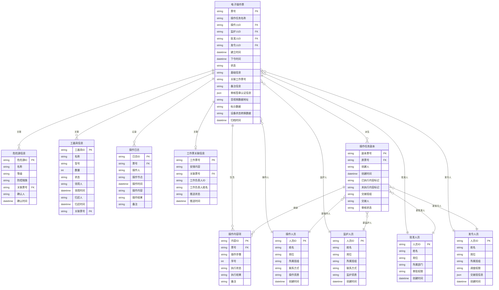
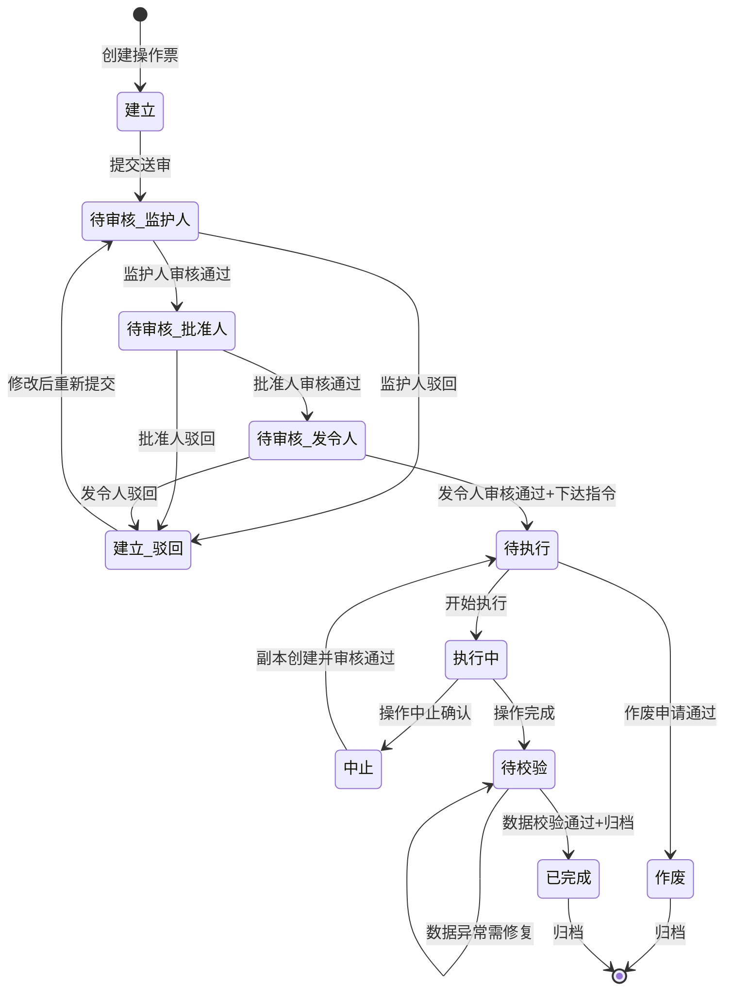

# 数据模型：操作票管理系统

**创建时间**：2026-05-13
**最后更新**：2026-05-16
**状态**：已完成

---

## 1. 数据模型概览

### 1.1 实体关系图（ER图）



### 1.2 实体概要

| 实体 | 描述 | 关键属性 | 关系 |
|------|------|----------|------|
| **电子操作票** | 核心实体，记录操作任务的全量信息 | 票号、状态、操作人ID、下令时间 | 包含操作内容项、关联危险源/工器具、派生副本 |
| **操作内容项** | 操作票的具体操作步骤明细 | 内容ID、票号、操作步骤、执行状态 | 属于电子操作票 |
| **操作人员** | 操作人基础信息 | 人员ID、姓名、操作资质 | 作为操作人关联操作票 |
| **监护人员** | 监护人基础信息 | 人员ID、姓名、监护资质 | 作为监护人关联操作票 |
| **批准人员** | 批准人基础信息 | 人员ID、姓名、审批权限 | 作为批准人关联操作票 |
| **发令人员** | 发令人基础信息 | 人员ID、姓名、调度权限、交接班信息 | 作为发令人关联操作票 |
| **操作任务副本** | 操作中止后生成的续作副本 | 副本票号、原票号、已执行标记、新人员信息 | 派生自电子操作票 |
| **危险源信息** | 操作涉及的风险点及防控措施 | 危险源ID、等级、防控措施、确认人 | 关联电子操作票 |
| **工器具信息** | 操作所需工器具及领用信息 | 工器具ID、名称、型号、领用归还记录 | 关联电子操作票 |
| **工作票关联信息** | 关联工作票及安措、工作负责人 | 工作票号、安措内容、工作负责人ID/姓名、推送状态 | 关联电子操作票 |
| **操作日志** | 操作过程的审计日志 | 日志ID、票号、操作节点、操作时间、操作结果 | 记录归属操作票 |

---

## 2. 实体定义

### 2.1 电子操作票（核心聚合根）

#### 基本信息

| 属性 | 值 |
|------|-----|
| **实体ID** | ENT-001 |
| **名称** | 电子操作票（OperationTicket） |
| **描述** | 操作票系统的核心聚合根，记录操作任务全量信息，驱动全生命周期流转 |
| **限界上下文** | 操作票管理 |
| **聚合根** | 是 |

#### 属性

| 属性名 | 类型 | 必填 | 唯一 | 默认值 | 描述 | 约束 |
|--------|------|------|------|--------|------|------|
| `ticket_id` | string | 是 | 是 | 自动生成 | 票号，唯一标识 | 格式：OP-YYYYMMDD-XXXXX |
| `task_name` | string | 是 | 否 | - | 操作任务名称 | 1-200字符 |
| `operator_id` | string | 是 | 否 | - | 操作人ID | 关联操作人员 |
| `supervisor_id` | string | 是 | 否 | - | 监护人ID | 关联监护人员 |
| `approver_id` | string | 否 | 否 | - | 批准人ID | 关联批准人员 |
| `dispatcher_id` | string | 否 | 否 | - | 发令人ID | 关联发令人员 |
| `created_at` | datetime | 是 | 否 | NOW() | 建立时间 | ISO 8601 |
| `dispatch_time` | datetime | 否 | 否 | - | 下令时间 | 发令人下达指令时写入 |
| `status` | enum | 是 | 否 | `建立` | 操作票状态 | [建立, 待审核(监护人), 待审核(批准人), 待审核(发令人), 待执行, 执行中, 中止, 已完成, 作废] |
| `basic_info` | json | 否 | 否 | {} | 基础信息（班组、区域等） | 灵活结构 |
| `work_ticket_no` | string | 否 | 否 | - | 关联工作票号 | 用于关联工作票 |
| `remarks` | text | 否 | 否 | - | 备注信息 | 最多2000字符 |
| `signature_info` | json | 否 | 否 | {} | 审核签章认证信息 | 存储各级签章数据 |
| `media_url` | string | 否 | 否 | - | 音视频数据地址 | 对象存储路径 |
| `tag_data` | json | 否 | 否 | {} | 标示数据 | 操作标示信息 |
| `equipment_state` | json | 否 | 否 | {} | 设备状态转换数据 | 设备状态变更记录 |
| `archived_at` | datetime | 否 | 否 | - | 归档时间 | 归档完成后写入 |

#### 业务规则

| 规则ID | 规则 | 校验方式 |
|--------|------|----------|
| BR-001 | 票号自动生成，全局唯一 | 数据库唯一约束 |
| BR-002 | 下令时间只有在发令人下达指令时写入 | 代码逻辑控制 |
| BR-003 | 操作票"作废"后不可编辑、不可执行 | 状态机校验 |
| BR-004 | 操作票锁定后（待执行起）禁止任何编辑 | 权限+状态双重校验 |
| BR-005 | 归档时间只有在归档完成后写入 | 业务逻辑控制 |

#### 索引

| 索引名 | 列 | 类型 | 用途 |
|--------|-----|------|------|
| `idx_ticket_operator` | operator_id | B-tree | 按操作人查询 |
| `idx_ticket_status` | status | B-tree | 按状态筛选 |
| `idx_ticket_created` | created_at | B-tree | 按创建时间排序 |
| `idx_ticket_workticket` | work_ticket_no | B-tree | 按工作票号关联查询 |
| `idx_ticket_status_created` | status, created_at | 复合索引 | 常用组合查询条件 |

---

### 2.2 操作内容项

#### 基本信息

| 属性 | 值 |
|------|-----|
| **实体ID** | ENT-002 |
| **名称** | 操作内容项（OperationItem） |
| **描述** | 操作票中具体的操作步骤明细，支持逐条标记执行状态 |
| **限界上下文** | 操作票管理 |
| **聚合根** | 否（属于电子操作票） |

#### 属性

| 属性名 | 类型 | 必填 | 唯一 | 默认值 | 描述 | 约束 |
|--------|------|------|------|--------|------|------|
| `item_id` | string | 是 | 是 | UUID | 内容项唯一ID | UUID v4 |
| `ticket_id` | string | 是 | 否 | - | 所属操作票号 | FK→电子操作票 |
| `step_content` | string | 是 | 否 | - | 操作步骤描述 | 1-500字符 |
| `sequence` | int | 是 | 否 | - | 步骤序号 | ≥ 1，按序递增 |
| `execute_status` | enum | 是 | 否 | `未执行` | 执行状态 | [未执行, 执行中, 已完成, 已跳过] |
| `execute_result` | string | 否 | 否 | - | 执行结果描述 | 可选 |
| `remarks` | string | 否 | 否 | - | 步骤备注 | 最多500字符 |

#### 索引

| 索引名 | 列 | 类型 | 用途 |
|--------|-----|------|------|
| `idx_item_ticket` | ticket_id | B-tree | 按操作票查询所有操作项 |
| `idx_item_ticket_seq` | ticket_id, sequence | 复合索引 | 按序号排序 |

---

### 2.3 操作任务副本

#### 基本信息

| 属性 | 值 |
|------|-----|
| **实体ID** | ENT-003 |
| **名称** | 操作任务副本（OperationCopy） |
| **描述** | 操作中止后生成的续作副本，继承原票已执行/未执行标记，支持信息补充和重新审核 |
| **限界上下文** | 操作票管理 |
| **聚合根** | 是 |

#### 属性

| 属性名 | 类型 | 必填 | 唯一 | 默认值 | 描述 | 约束 |
|--------|------|------|------|--------|------|------|
| `copy_id` | string | 是 | 是 | 自动生成 | 副本票号 | 格式：CP-YYYYMMDD-XXXXX |
| `original_ticket_id` | string | 是 | 否 | - | 原操作票号 | FK→电子操作票 |
| `creator_id` | string | 是 | 否 | - | 创建人（发令人） | 关联发令人员 |
| `created_at` | datetime | 是 | 否 | NOW() | 创建时间 | ISO 8601 |
| `executed_items` | json | 是 | 否 | [] | 已执行操作内容标记 | 原票已执行项的ID列表 |
| `unexecuted_items` | json | 是 | 否 | [] | 未执行操作内容标记 | 原票未执行项的ID列表 |
| `handover_group` | string | 否 | 否 | - | 交接班组 | |
| `handover_person` | string | 否 | 否 | - | 交接人 | |
| `new_operator_id` | string | 否 | 否 | - | 新操作人ID | 补充信息 |
| `new_supervisor_id` | string | 否 | 否 | - | 新监护人ID | 补充信息 |
| `new_approver_id` | string | 否 | 否 | - | 新批准人ID | 补充信息 |
| `new_dispatcher_id` | string | 否 | 否 | - | 新发令人ID | 补充信息 |
| `review_status` | enum | 是 | 否 | `待补充` | 审核状态 | [待补充, 待审核(监护人), 待审核(批准人), 待审核(发令人), 待执行] |

---

### 2.4 操作人员

#### 基本信息

| 属性 | 值 |
|------|-----|
| **实体ID** | ENT-004 |
| **名称** | 操作人员（Operator） |
| **描述** | 具有操作资质、可执行现场操作任务的人员 |
| **限界上下文** | 人员管理 |
| **聚合根** | 是 |

#### 属性

| 属性名 | 类型 | 必填 | 唯一 | 默认值 | 描述 | 约束 |
|--------|------|------|------|--------|------|------|
| `operator_id` | string | 是 | 是 | UUID | 人员唯一ID | UUID v4 |
| `name` | string | 是 | 否 | - | 姓名 | 2-50字符 |
| `position` | string | 否 | 否 | - | 岗位 | |
| `team` | string | 否 | 否 | - | 所属班组 | |
| `phone` | string | 否 | 否 | - | 联系方式 | 手机号格式 |
| `qualification` | string | 否 | 否 | - | 操作资质 | |
| `created_at` | datetime | 是 | 否 | NOW() | 创建时间 | ISO 8601 |

---

### 2.5 监护人员

#### 基本信息

| 属性 | 值 |
|------|-----|
| **实体ID** | ENT-005 |
| **名称** | 监护人员（Supervisor） |
| **描述** | 具有监护资质、可对操作进行安全监护的人员 |
| **限界上下文** | 人员管理 |
| **聚合根** | 是 |

#### 属性

| 属性名 | 类型 | 必填 | 唯一 | 默认值 | 描述 | 约束 |
|--------|------|------|------|--------|------|------|
| `supervisor_id` | string | 是 | 是 | UUID | 人员唯一ID | UUID v4 |
| `name` | string | 是 | 否 | - | 姓名 | 2-50字符 |
| `position` | string | 否 | 否 | - | 岗位 | |
| `team` | string | 否 | 否 | - | 所属班组 | |
| `phone` | string | 否 | 否 | - | 联系方式 | 手机号格式 |
| `qualification` | string | 否 | 否 | - | 监护资质 | |
| `created_at` | datetime | 是 | 否 | NOW() | 创建时间 | ISO 8601 |

---

### 2.6 批准人员

#### 基本信息

| 属性 | 值 |
|------|-----|
| **实体ID** | ENT-006 |
| **名称** | 批准人员（Approver） |
| **描述** | 具有审批权限、可对操作票进行二级审核批准的管理人员 |
| **限界上下文** | 人员管理 |
| **聚合根** | 是 |

#### 属性

| 属性名 | 类型 | 必填 | 唯一 | 默认值 | 描述 | 约束 |
|--------|------|------|------|--------|------|------|
| `approver_id` | string | 是 | 是 | UUID | 人员唯一ID | UUID v4 |
| `name` | string | 是 | 否 | - | 姓名 | 2-50字符 |
| `position` | string | 否 | 否 | - | 岗位 | |
| `department` | string | 否 | 否 | - | 所属部门 | |
| `phone` | string | 否 | 否 | - | 联系方式 | 手机号格式 |
| `approval_level` | string | 否 | 否 | - | 审批权限等级 | |
| `created_at` | datetime | 是 | 否 | NOW() | 创建时间 | ISO 8601 |

---

### 2.7 发令人员

#### 基本信息

| 属性 | 值 |
|------|-----|
| **实体ID** | ENT-007 |
| **名称** | 发令人员（Dispatcher） |
| **描述** | 具有调度权限、可下达操作指令和处理异常交接的调度人员 |
| **限界上下文** | 人员管理 |
| **聚合根** | 是 |

#### 属性

| 属性名 | 类型 | 必填 | 唯一 | 默认值 | 描述 | 约束 |
|--------|------|------|------|--------|------|------|
| `dispatcher_id` | string | 是 | 是 | UUID | 人员唯一ID | UUID v4 |
| `name` | string | 是 | 否 | - | 姓名 | 2-50字符 |
| `position` | string | 否 | 否 | - | 岗位 | |
| `team` | string | 否 | 否 | - | 所属班组 | |
| `phone` | string | 否 | 否 | - | 联系方式 | 手机号格式 |
| `dispatch_authority` | string | 否 | 否 | - | 调度权限 | |
| `handover_info` | json | 否 | 否 | {} | 交接班信息 | 交接记录 |
| `created_at` | datetime | 是 | 否 | NOW() | 创建时间 | ISO 8601 |

---

### 2.8 危险源信息

#### 基本信息

| 属性 | 值 |
|------|-----|
| **实体ID** | ENT-008 |
| **名称** | 危险源信息（Hazard） |
| **描述** | 操作任务涉及的风险点、危险源及对应的防控措施 |
| **限界上下文** | 操作票管理 |
| **聚合根** | 否（属于电子操作票） |

#### 属性

| 属性名 | 类型 | 必填 | 唯一 | 默认值 | 描述 | 约束 |
|--------|------|------|------|--------|------|------|
| `hazard_id` | string | 是 | 是 | UUID | 危险源唯一ID | UUID v4 |
| `ticket_id` | string | 是 | 否 | - | 所属操作票号 | FK→电子操作票 |
| `name` | string | 是 | 否 | - | 危险源名称 | |
| `level` | enum | 是 | 否 | - | 风险等级 | [高, 中, 低] |
| `control_measure` | string | 是 | 否 | - | 防控措施描述 | |
| `confirm_person` | string | 否 | 否 | - | 确认人 | |
| `confirmed_at` | datetime | 否 | 否 | - | 确认时间 | ISO 8601 |

#### 索引

| 索引名 | 列 | 类型 | 用途 |
|--------|-----|------|------|
| `idx_hazard_ticket` | ticket_id | B-tree | 按操作票查询危险源 |

---

### 2.9 工器具信息

#### 基本信息

| 属性 | 值 |
|------|-----|
| **实体ID** | ENT-009 |
| **名称** | 工器具信息（Tool） |
| **描述** | 操作任务所需的工器具及领用归还记录 |
| **限界上下文** | 操作票管理 |
| **聚合根** | 否（属于电子操作票） |

#### 属性

| 属性名 | 类型 | 必填 | 唯一 | 默认值 | 描述 | 约束 |
|--------|------|------|------|--------|------|------|
| `tool_id` | string | 是 | 是 | UUID | 工器具唯一ID | UUID v4 |
| `ticket_id` | string | 是 | 否 | - | 所属操作票号 | FK→电子操作票 |
| `name` | string | 是 | 否 | - | 工器具名称 | |
| `model` | string | 否 | 否 | - | 型号规格 | |
| `quantity` | int | 是 | 否 | 1 | 数量 | ≥ 1 |
| `status` | enum | 是 | 否 | `待领用` | 状态 | [待领用, 已领用, 已归还] |
| `borrower` | string | 否 | 否 | - | 领用人 | |
| `borrowed_at` | datetime | 否 | 否 | - | 领用时间 | ISO 8601 |
| `return_person` | string | 否 | 否 | - | 归还人 | |
| `returned_at` | datetime | 否 | 否 | - | 归还时间 | ISO 8601 |

#### 索引

| 索引名 | 列 | 类型 | 用途 |
|--------|-----|------|------|
| `idx_tool_ticket` | ticket_id | B-tree | 按操作票查询工器具 |

---

### 2.10 工作票关联信息

#### 基本信息

| 属性 | 值 |
|------|-----|
| **实体ID** | ENT-010 |
| **名称** | 工作票关联信息（WorkTicketInfo） |
| **描述** | 操作票关联的工作票信息，包含安措内容和操作结果推送状态 |
| **限界上下文** | 操作票管理 |
| **聚合根** | 否（属于电子操作票） |

#### 属性

| 属性名 | 类型 | 必填 | 唯一 | 默认值 | 描述 | 约束 |
|--------|------|------|------|--------|------|------|
| `work_ticket_no` | string | 是 | 是 | - | 工作票编号 | 全局唯一 |
| `safety_measures` | text | 是 | 否 | - | 安措内容 | 关联工作票的安全措施 |
| `ticket_id` | string | 是 | 否 | - | 关联操作票号 | FK→电子操作票 |
| `worker_id` | string | 否 | 否 | - | 工作负责人ID | |
| `worker_name` | string | 否 | 否 | - | 工作负责人姓名 | |
| `push_status` | enum | 是 | 否 | `待推送` | 推送状态 | [待推送, 推送中, 推送成功, 推送失败] |
| `pushed_at` | datetime | 否 | 否 | - | 推送时间 | ISO 8601 |

#### 索引

| 索引名 | 列 | 类型 | 用途 |
|--------|-----|------|------|
| `idx_workticket_ticket` | ticket_id | B-tree | 按操作票查询工作票关联信息 |

> **说明**：工作负责人是外部角色，仅作为工作票关联信息的属性存储（ID+姓名），不设独立的人员表。操作结果通过三峡行云推送给工作负责人。

---

### 2.11 操作日志

#### 基本信息

| 属性 | 值 |
|------|-----|
| **实体ID** | ENT-011 |
| **名称** | 操作日志（OperationLog） |
| **描述** | 操作票全生命周期中的关键操作审计记录 |
| **限界上下文** | 操作票管理 |
| **聚合根** | 否（属于电子操作票） |

#### 属性

| 属性名 | 类型 | 必填 | 唯一 | 默认值 | 描述 | 约束 |
|--------|------|------|------|--------|------|------|
| `log_id` | string | 是 | 是 | UUID | 日志唯一ID | UUID v4 |
| `ticket_id` | string | 是 | 否 | - | 所属操作票号 | FK→电子操作票 |
| `operator_id` | string | 是 | 否 | - | 操作人 | |
| `action_node` | string | 是 | 否 | - | 操作节点 | 如：create, approve, reject, execute |
| `action_time` | datetime | 是 | 否 | NOW() | 操作时间 | ISO 8601 |
| `action_detail` | json | 否 | 否 | - | 操作详情 | 存储状态变更、意见等 |
| `result` | string | 是 | 否 | `success` | 操作结果 | success / fail |
| `remarks` | string | 否 | 否 | - | 备注 | 最多500字符 |

#### 索引

| 索引名 | 列 | 类型 | 用途 |
|--------|-----|------|------|
| `idx_log_ticket` | ticket_id | B-tree | 按操作票查询所有日志 |
| `idx_log_time` | action_time | B-tree | 按时间排序 |
| `idx_log_ticket_time` | ticket_id, action_time | 复合索引 | 按操作票+时间排序 |

---

## 3. 关系

### 3.1 关系矩阵

| 源实体 | 关系 | 目标实体 | 基数 | 描述 |
|--------|------|----------|------|------|
| 电子操作票 | 包含 | 操作内容项 | 1:N | 一个操作票包含多个操作步骤 |
| 电子操作票 | 关联 | 危险源信息 | 1:N | 一个操作票关联多个危险源 |
| 电子操作票 | 关联 | 工器具信息 | 1:N | 一个操作票关联多个工器具 |
| 电子操作票 | 记录 | 操作日志 | 1:N | 一个操作票有多个操作日志 |
| 电子操作票 | 关联 | 工作票关联信息 | 1:1 | 一个操作票关联一张工作票 |
| 电子操作票 | 派生 | 操作任务副本 | 1:N | 一个操作票可派生多个副本 |
| 电子操作票 | 操作人 | 操作人员 | N:1 | 多个操作票可对应同一操作人 |
| 电子操作票 | 监护人 | 监护人员 | N:1 | 多个操作票可对应同一监护人 |
| 电子操作票 | 批准人 | 批准人员 | N:1 | 多个操作票可对应同一批准人 |
| 电子操作票 | 发令人 | 发令人员 | N:1 | 多个操作票可对应同一个人 |
| 操作任务副本 | 继承 | 操作内容项 | 1:N | 副本继承原票的操作内容 |
| 操作任务副本 | 关联人员 | 各类人员 | N:1 | 副本可补充新的人员信息 |

### 3.2 关系详情

#### 电子操作票 → 操作内容项

| 属性 | 值 |
|------|-----|
| **源实体** | 电子操作票 |
| **目标实体** | 操作内容项 |
| **基数** | 一对多（1:N） |
| **导航性** | 双向 |
| **级联删除** | 是（操作票删除时级联删除操作内容） |
| **外键** | `操作内容项.ticket_id` → `电子操作票.ticket_id` |

**业务规则**：操作内容项按序号递增排序，执行后不可修改内容。

#### 电子操作票 → 操作任务副本

| 属性 | 值 |
|------|-----|
| **源实体** | 电子操作票（原票） |
| **目标实体** | 操作任务副本 |
| **基数** | 一对多（1:N） |
| **导航性** | 单向（副本可查原票，原票不直接引用副本） |
| **级联删除** | 否（副本独立存储） |
| **外键** | `操作任务副本.original_ticket_id` → `电子操作票.ticket_id` |

**业务规则**：创建副本时不删除原票数据，原票保持"中止"状态。

---

## 4. 状态图

### 4.1 电子操作票生命周期



### 4.2 状态定义

| 状态 | 描述 | 入口动作 | 出口动作 | 允许的迁移 |
|------|------|----------|----------|------------|
| **建立** | 初始创建状态 | 初始化表单、生成票号 | 校验必填字段 | 提交送审、作废 |
| **待审核（监护人）** | 等待监护人审核 | 向监护人推送待办 | - | 审核通过、驳回 |
| **待审核（批准人）** | 等待批准人审核 | 向批准人推送待办 | - | 审核通过、驳回 |
| **待审核（发令人）** | 等待发令人审核 | 向发令人推送待办 | - | 审核通过（+下达指令）、驳回 |
| **待执行** | 审核通过，等待现场操作 | 写入下令时间，锁定信息 | - | 开始执行、作废 |
| **执行中** | 现场正在操作 | 启动数据同步 | 停止数据同步 | 操作完成、中止 |
| **中止** | 操作中止 | 标记未执行内容 | - | 创建副本后进入副本流程 |
| **建立（驳回）** | 被驳回合需修改 | 通知操作人 | - | 修改后重新提交、作废 |
| **已完成** | 操作完成并归档 | 生成PDF，结构化存储 | - | 查询 |
| **作废** | 操作票作废 | 记录作废信息 | - | 归档 |

### 4.3 状态迁移规则

| 从状态 | 到状态 | 触发条件 | 守卫条件 | 执行动作 |
|--------|--------|----------|----------|----------|
| 建立 | 待审核（监护人） | 提交送审 | 所有必填字段已填写 | 推送待办至监护人 |
| 待审核（监护人） | 待审核（批准人） | 监护人审核通过 | 监护人已签章 | 推送待办至批准人 |
| 待审核（监护人） | 建立（驳回） | 监护人驳回 | 填写了驳回意见 | 通知操作人 |
| 待审核（批准人） | 待审核（发令人） | 批准人审核通过 | 批准人已签章 | 推送待办至发令人 |
| 待审核（发令人） | 待执行 | 发令人下达指令 | 发令人已审核签章 | 写入下令时间，锁定信息 |
| 待执行 | 执行中 | 操作人开始执行 | 操作人身份验证通过 | 启动数据同步 |
| 执行中 | 待校验 | 所有操作完成 | 操作人确认完成 | 触发数据校验流程 |
| 执行中 | 中止 | 发令人确认中止 | 填写了中止备注 | 标记未执行内容 |
| 待校验 | 已完成 | 数据校验通过+归档完成 | 数据一致性100% | 生成PDF，结构化存储 |
| 待校验 | 待校验 | 数据异常 | 存在异常数据标记 | 标记异常项，等待修复 |
| 建立（驳回） | 待审核（监护人） | 重新提交送审 | 已根据驳回意见修改 | 重新进入审核流程 |
| 待执行 | 作废 | 作废申请审批通过 | 操作票未开始执行 | 记录作废信息 |
| 中止 | [副本待执行] | 副本创建并完成三级审核 | 副本信息已补充完整 | 副本进入待执行 |

---

## 5. 数据约束

### 5.1 校验规则

| 约束ID | 实体 | 字段 | 规则 | 错误提示 |
|--------|------|------|------|----------|
| VAL-001 | 电子操作票 | ticket_id | 票号自动生成，格式：OP-YYYYMMDD-XXXXX | "票号格式错误" |
| VAL-002 | 电子操作票 | task_name | 操作任务名称不能为空，最长200字符 | "操作任务名称不能为空" |
| VAL-003 | 电子操作票 | operator_id | 操作人必须存在且具有操作资质 | "操作人信息无效" |
| VAL-004 | 电子操作票 | supervisor_id | 监护人必须存在且具有监护资质 | "监护人信息无效" |
| VAL-005 | 操作内容项 | step_content | 操作步骤描述不能为空 | "操作步骤内容不能为空" |
| VAL-006 | 操作内容项 | sequence | 序号必须大于0且在同一操作票内不重复 | "序号重复" |
| VAL-007 | 操作任务副本 | original_ticket_id | 原操作票必须存在且状态为"中止" | "原操作票不支持创建副本" |
| VAL-008 | 电子操作票 | status | 状态迁移必须遵循状态机定义 | "非法状态迁移" |
| VAL-009 | 操作票作废 | status | 只有"待执行"及之前状态可作废 | "当前状态不可作废" |
| VAL-010 | 电子操作票 | dispatch_time | 只有在发令人下达指令时写入 | "下令时间写入条件不满足" |

### 5.2 引用完整性

| 约束 | 父表 | 子表 | 删除策略 | 更新策略 |
|------|------|------|----------|----------|
| FK_item_ticket | 电子操作票 | 操作内容项 | CASCADE | CASCADE |
| FK_hazard_ticket | 电子操作票 | 危险源信息 | CASCADE | CASCADE |
| FK_tool_ticket | 电子操作票 | 工器具信息 | CASCADE | CASCADE |
| FK_log_ticket | 电子操作票 | 操作日志 | CASCADE | CASCADE |
| FK_copy_original | 电子操作票 | 操作任务副本 | RESTRICT | CASCADE |
| FK_workticket_opticket | 电子操作票 | 工作票关联信息 | RESTRICT | CASCADE |

### 5.3 唯一性约束

| 约束 | 实体 | 字段 | 范围 | 描述 |
|------|------|------|------|------|
| UQ_ticket_id | 电子操作票 | ticket_id | 全局 | 票号全局唯一 |
| UQ_copy_id | 操作任务副本 | copy_id | 全局 | 副本票号全局唯一 |
| UQ_item_ticket_seq | 操作内容项 | ticket_id, sequence | 每操作票 | 同一操作票内序号不重复 |

---

## 6. 数据量估算

### 6.1 增长预估

| 实体 | 初始量 | 月增量 | 1年预估 | 单条存储 |
|------|--------|--------|---------|----------|
| 电子操作票 | 500 | +200/月 | 2,900 | ~5 KB |
| 操作内容项 | 5,000 | +2,000/月 | 29,000 | ~1 KB |
| 危险源信息 | 2,500 | +1,000/月 | 14,500 | ~1 KB |
| 工器具信息 | 2,000 | +800/月 | 11,600 | ~1 KB |
| 操作日志 | 10,000 | +4,000/月 | 58,000 | ~0.5 KB |
| 操作任务副本 | 100 | +40/月 | 580 | ~3 KB |
| 操作人员 | 50 | +5/月 | 110 | ~1 KB |
| 工作票关联信息 | 500 | +200/月 | 2,900 | ~2 KB |

### 6.2 性能考虑

| 查询模式 | 频率 | 期望延迟 | 索引策略 |
|---------|------|----------|----------|
| 按票号查询操作票 | 高 | < 50ms | 主键索引 |
| 按状态筛选待办操作票 | 高 | < 100ms | 状态索引+复合索引(状态,创建时间) |
| 按操作人查询 | 中 | < 100ms | 操作人ID索引 |
| 按时间范围查询 | 中 | < 200ms | 创建时间索引 |
| 按工作票号关联查询 | 低 | < 100ms | 工作票号索引 |
| 按班组+时间统计 | 低 | < 500ms | 复合索引(班组,创建时间) |

---

## 7. 数据字典

### 7.1 标准字段类型

| 类型名 | 基础类型 | 格式 | 示例 |
|--------|----------|------|------|
| `id` | string | UUID v4 | `550e8400-e29b-41d4-a716-446655440000` |
| `ticket_no` | string | 自定义 | `OP-20260513-00001` |
| `work_ticket_no` | string | 自定义 | `WT-20260513-0001` |
| `phone` | string | 手机号 | `13800138000` |
| `datetime` | datetime | ISO 8601 | `2026-05-13T10:30:00Z` |
| `json` | json | JSON对象 | `{"key": "value"}` |
| `text` | string | 长文本 | Max 2000字符 |

### 7.2 枚举类型

#### 操作票状态（`ticket_status`）

| 值 | 标签 | 描述 |
|----|------|------|
| `draft` | 建立 | 操作票已创建，未提交 |
| `pending_supervisor` | 待审核（监护人） | 等待监护人审核 |
| `pending_approver` | 待审核（批准人） | 等待批准人审核 |
| `pending_dispatcher` | 待审核（发令人） | 等待发令人审核 |
| `pending_execute` | 待执行 | 审核已通过，等待现场执行 |
| `executing` | 执行中 | 正在现场操作 |
| `suspended` | 中止 | 操作中止 |
| `completed` | 已完成 | 操作完成并归档 |
| `voided` | 作废 | 操作票作废 |
| `rejected` | 建立（驳回） | 审核驳回，待修改 |

#### 操作项执行状态（`item_status`）

| 值 | 标签 | 描述 |
|----|------|------|
| `pending` | 未执行 | 尚未执行该操作步骤 |
| `executing` | 执行中 | 正在执行该步骤 |
| `completed` | 已完成 | 该步骤已完成 |
| `skipped` | 已跳过 | 该步骤被跳过 |

---

## 8. 领域术语表

| 术语 | 定义 | 同义词 | 关联实体 |
|------|------|--------|----------|
| **操作票** | 用于规范电力现场操作任务的电子工单，包含操作内容、人员、安全措施等全量信息 | 操作工单、电子操作票 | 电子操作票、操作内容项 |
| **三级审核** | 监护人→批准人→发令人依次对操作票进行审核的流程 | 三级审批 | 电子操作票（状态） |
| **下令时间** | 发令人下达操作指令的系统当前时间，操作票正式生效的标记 | 生效时间 | 电子操作票 |
| **操作中止** | 现场操作过程中因故需要中止操作，系统标记未执行内容 | 暂停、中断 | 电子操作票、操作任务副本 |
| **操作任务副本** | 操作中止后生成的续作操作票，继承原票已执行/未执行标记 | 副本、续作票 | 操作任务副本 |
| **总召校验** | 操作结束后全量拉取现场终端与后台数据进行一致性对比校验 | 数据校验、一致性检查 | 电子操作票 |
| **三峡行云** | 三峡集团内部消息推送平台 | 行云推送 | 工作票关联信息 |
| **安措** | 安全措施，与工作票关联的安全操作要求 | 安全措施 | 工作票关联信息 |

---

## 9. 数据模型可追溯性

### 9.1 需求映射

| 实体 | 来源需求 | 关联用户故事 |
|------|----------|-------------|
| 电子操作票 | PRD 实体清单、功能清单 | US-001a, US-001b, US-001c, US-002, US-006 |
| 操作内容项 | PRD 操作票建立、执行功能 | US-001a, US-003b, US-007a |
| 操作任务副本 | PRD 操作票中止与副本管理 | US-017, US-018, US-019, US-020 |
| 操作人员 | PRD 操作人角色、人员信息管理 | US-001a, US-001b, US-014 |
| 监护人员 | PRD 监护人角色、人员信息管理 | US-003a, US-003b, UC-003 |
| 批准人员 | PRD 批准人角色 | US-004, UC-003 |
| 发令人员 | PRD 发令人角色 | US-005, US-006, US-017 |
| 危险源信息 | PRD 危险源列表功能 | US-001b |
| 工器具信息 | PRD 工器具列表功能 | US-001b |
| 工作票关联信息 | PRD 工作票关联、操作结果推送 | US-001c, US-012 |
| 操作日志 | PRD 操作日志实体 | US-007a, US-007b |

### 9.2 变更历史

| 版本 | 日期 | 作者 | 变更 |
|------|------|------|------|
| 1.0 | 2026-05-13 | Requirements Analyst | 初始数据模型，基于 PRD.md 创建 |
| 1.1 | 2026-05-16 | Requirements Analyst | 补齐实体定义：监护人员(2.5)、批准人员(2.6)、发令人员(2.7)、危险源信息(2.8)、工器具信息(2.9)、工作票关联信息(2.10)、操作日志(2.11)；更新需求映射 |

---

## 10. 备注与决策

### 10.1 设计决策

| 决策ID | 决策 | 原因 | 备选方案 |
|--------|------|------|----------|
| DD-001 | 电子操作票作为聚合根，操作内容项作为值对象 | 操作内容项的生命周期完全依赖操作票，无独立存在意义 | 将操作内容项设计为独立实体 |
| DD-002 | 四类人员（操作人/监护人/批准人/发令人）设计为独立实体而非统一人员表 | 四类人员属性差异大（资质、权限、部门），分开更清晰 | 统一人员表+角色字段 |
| DD-003 | 状态使用字符串枚举，而非整数编码 | 字符串可读性好，便于调试和日志分析 | 整数编码、状态模式对象 |
| DD-004 | 操作任务副本独立存储，而非在原票上标记 | 副本需要独立的状态流转和人员信息，独立存储更灵活 | 在原票新增副本标记字段 |
| DD-005 | 音视频数据使用URL引用，而非直接存储 | 音视频文件大，直接存储会影响数据库性能 | 数据库BLOB存储 |

### 10.2 待解决问题

| 问题ID | 问题 | 影响 | 状态 |
|--------|------|------|------|
| Q-001 | 音视频数据存储方案的选型（对象存储/文件服务器/云存储） | 影响数据存储架构设计 | 待定 |
| Q-002 | 操作票审批中是否需要电子签章/数字签名 | 影响审核功能的安全设计 | 待定 |
| Q-003 | 三峡行云接口的具体规范和推送协议 | 影响操作结果推送的实现 | 待定（需外部确认） |

### 10.3 假设

| 假设ID | 假设 | 风险等级 |
|--------|------|----------|
| A-001 | 操作票的票号格式为 OP-YYYYMMDD-XXXXX，日序号从00001递增 | 低 |
| A-002 | 四级人员（操作人/监护人/批准人/发令人）互斥，一人不可兼任两个角色 | 中（已确认，无需调整） |
| A-003 | 现场网络环境不稳定，需要断点续传机制 | 低（需求明确） |
| A-004 | 操作票平均包含10条操作内容项 | 低 |
| A-005 | 三峡行云接口支持JSON格式的数据推送 | 高（若接口格式不同需调整） |
```
