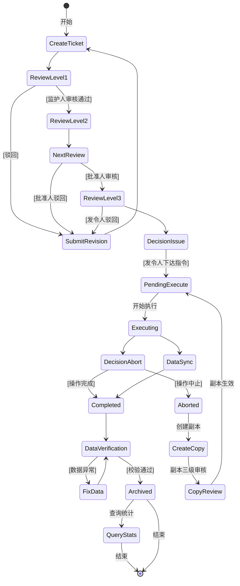
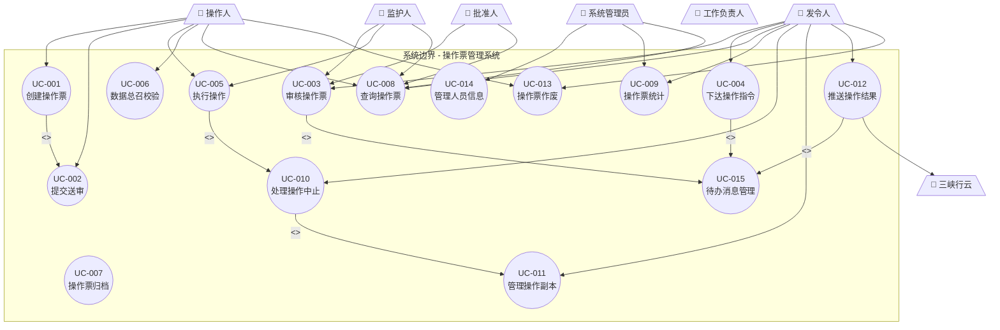
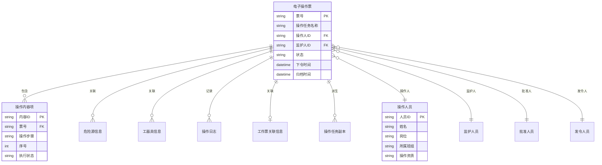
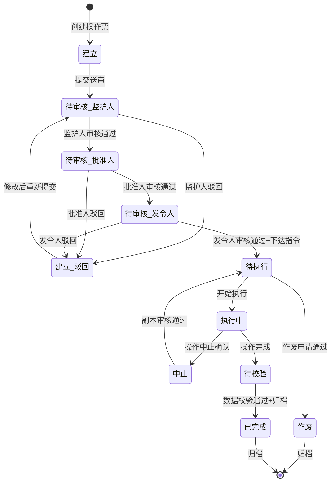
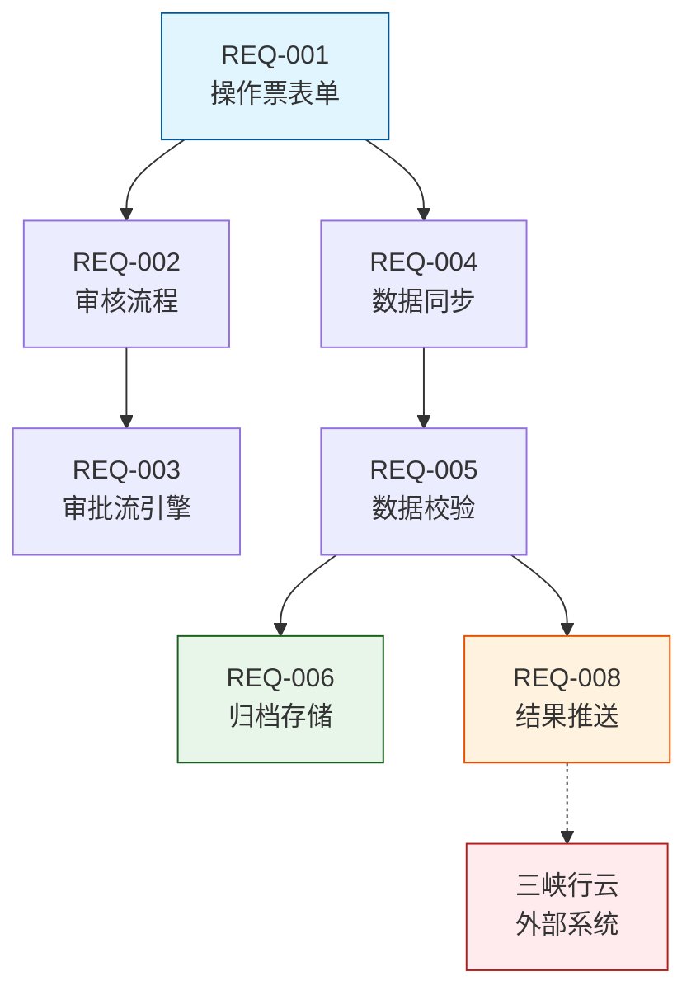
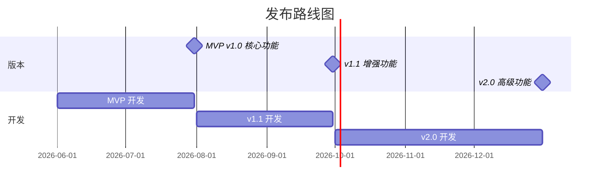

# 产品需求文档 (PRD)

# 操作票管理系统

---

## 文档信息

| 字段 | 值 |
|------|-----|
| **产品名称** | 操作票管理系统 |
| **版本** | v1.0.0 |
| **创建日期** | 2026-05-13 |
| **最后更新** | 2026-05-13 |
| **负责人** | Requirements Analyst |
| **状态** | 草稿 |
| **基线** | v1.0.0 |

### 文档历史

| 版本 | 日期 | 作者 | 变更 | 批准人 |
|------|------|------|------|--------|
| 0.1 | 2026-05-13 | Requirements Analyst | 初始草稿 | - |
| 1.0 | 2026-05-13 | Requirements Analyst | 基线发布 | 待签核 |

### 相关文档

| 文档 | 位置 | 描述 |
|------|------|------|
| 需求分析 | `.kiro/specs/operation-ticket-system/requirements.md` | 详细需求分析 |
| 数据模型 | `.kiro/specs/operation-ticket-system/data-model.md` | 数据结构定义 |
| 澄清日志 | `.kiro/specs/operation-ticket-system/clarification.md` | 决策记录 |
| 验证报告 | `.kiro/specs/operation-ticket-system/validation.md` | 验证报告 |
| API规范 | `.kiro/specs/operation-ticket-system/api.yaml` | API契约 |
| RTM | `.kiro/specs/operation-ticket-system/rtm.md` | 追溯矩阵 |

---

## 1. 执行摘要

### 1.1 概述

操作票管理系统是一套面向电力现场作业的电子化操作票管理平台，围绕**操作人、监护人、批准人、发令人**四大核心角色，实现操作票的全生命周期管理——从建票、三级审核、指令下达、现场执行到收尾归档的全流程数字化。

本系统采用**响应式Web架构**，一套代码覆盖PC和移动端，无需安装原生App。系统核心价值在于：规范操作票流程、确保操作安全合规、实现现场数据实时同步、提供完整的审计追溯能力。

### 1.2 关键亮点

| 维度 | 总结 |
|------|------|
| **目标用户** | 操作人、监护人、批准人、发令人、工作负责人 |
| **核心价值** | 操作票全生命周期数字化，流程规范化，数据可追溯 |
| **MVP范围** | 建票送审、三级审核、指令下达、现场执行、收尾归档、查询统计 |
| **成功指标** | 操作票创建成功率 ≥ 99.5%，三级审核平均完成时间 ≤ 24小时 |

### 1.3 验证状态

| 维度 | 分数 | 状态 |
|------|------|------|
| 真实性 | 92% | ✅ 通过 |
| 完整性 | 88% | ⚠️ 良好 |
| 一致性 | 95% | ✅ 通过 |
| 可行性 | 90% | ✅ 通过 |
| 可验证性 | 85% | ✅ 通过 |

---

## 2. 产品概述

### 2.1 产品愿景

成为电力行业操作票数字化管理的标准平台，实现操作票全流程无纸化、智能化，提升现场作业安全性和效率。

### 2.2 问题陈述

| 方面 | 描述 |
|------|------|
| **当前状态** | 纸质操作票管理，流转效率低，审核周期长，数据难以追溯和统计 |
| **痛点** | 操作票填写不规范、审核流程不可控、现场数据无法实时同步、归档查询困难 |
| **影响** | 操作风险增加、管理成本高、历史数据难以利用 |
| **证据** | 行业普遍存在的纸质流程效率低下问题，PRD基于实际现场作业需求编制 |

### 2.3 产品目标

| ID | 目标 | 成功指标 | 目标值 | 测量方法 |
|----|------|----------|--------|----------|
| OBJ-001 | 实现操作票全流程电子化 | 操作票电子化覆盖率 | 100% | 系统统计 |
| OBJ-002 | 缩短审核周期 | 三级审核平均完成时间 | ≤ 24小时 | 系统日志 |
| OBJ-003 | 确保数据完整性 | 数据上传成功率 | ≥ 99% | 数据校验 |
| OBJ-004 | 提供完整审计追溯 | 关键操作日志覆盖率 | 100% | 日志分析 |

### 2.4 范围定义

#### 在范围

| ID | 功能/能力 | 发布 | 优先级 |
|----|-----------|------|--------|
| S-001 | 操作票创建与送审 | MVP | P0 |
| S-002 | 三级审核流程 | MVP | P0 |
| S-003 | 指令下达与锁定 | MVP | P0 |
| S-004 | 现场执行与数据同步 | MVP | P0 |
| S-005 | 数据总召校验 | MVP | P0 |
| S-006 | 操作票查询 | MVP | P0 |
| S-007 | 操作票统计 | v1.1 | P1 |
| S-008 | 操作中止与副本管理 | v1.1 | P1 |
| S-009 | 操作结果推送（三峡行云） | v1.1 | P1 |
| S-010 | PDF归档 | v2.0 | P2 |
| S-011 | 对外数据接口 | v2.0 | P2 |

#### 不在范围

| 项目 | 原因 | 未来考虑 |
|------|------|----------|
| 原生移动App开发 | 已确认响应式Web方案 | 不再考虑 |
| 工作票管理系统 | 仅关联工作票号，不管理工作票本身 | v2.0后 |
| AI智能分析 | 非当前需求 | v3.0 |

#### 假设

| ID | 假设 | 错误影响 | 验证状态 |
|----|------|----------|----------|
| A-001 | 操作票票号格式 OP-YYYYMMDD-XXXXX | 低 | 已验证 |
| A-002 | 四级人员（操作/监护/批准/发令）严格互斥 | 中（已确认无需调整） | 已验证 |
| A-003 | 现场网络环境不稳定，需断点续传 | 低 | 已验证 |
| A-004 | 操作票平均包含10条操作内容项 | 低 | 待验证 |
| A-005 | 三峡行云接口支持JSON格式推送 | 高 | 待验证 |

#### 约束

| ID | 约束 | 类型 | 影响 |
|----|------|------|------|
| C-001 | 采用响应式Web架构，不开发原生App | 技术 | 离线能力受限 |
| C-002 | 待办通知仅限系统内通知 | 技术 | 不依赖外部推送服务 |
| C-003 | 音视频数据数据库BLOB存储+永久保留 | 业务 | 数据库容量需关注 |
| C-004 | 遵循电力行业通用操作票规范 | 业务 | 满足"两票三制"基本要求 |

---

## 3. 用户分析

### 3.1 用户角色画像

#### 角色1：操作人

| 属性 | 描述 |
|------|------|
| **角色** | 现场执行操作任务的作业人员 |
| **目标** | 高效建票、准确执行操作、完整上传现场数据 |
| **痛点** | 纸质操作票填写繁琐、现场数据记录困难、审核周期长 |
| **关键活动** | 建票、执行操作、数据上传、查询历史 |
| **成功标准** | 操作票创建时间 ≤ 3分钟，数据上传成功率 ≥ 99% |

#### 角色2：监护人

| 属性 | 描述 |
|------|------|
| **角色** | 对操作人作业进行全程监护的人员 |
| **目标** | 严格审核操作票、现场监护作业安全、确保数据完整 |
| **痛点** | 审核信息不便编辑修改、现场数据不可实时查看 |
| **关键活动** | 审核操作票、现场监护、归档确认 |

#### 角色3：批准人

| 属性 | 描述 |
|------|------|
| **角色** | 具有批准权限的管理人员 |
| **目标** | 把控操作票质量、确保操作合规性 |
| **关键活动** | 审核操作票、管理审批 |

#### 角色4：发令人

| 属性 | 描述 |
|------|------|
| **角色** | 下达操作指令的调度人员 |
| **目标** | 准确下达指令、实时监控操作过程、处理异常与交接 |
| **关键活动** | 审核操作票、下达指令、操作管控、中止处理、任务交接 |

#### 角色5：工作负责人

| 属性 | 描述 |
|------|------|
| **角色** | 关联工作票的责任人 |
| **目标** | 及时获取操作结果及安措关联信息 |
| **关键活动** | 接收操作结果推送 |

### 3.2 核心用户活动流



### 3.3 活动详情

| 活动 | 描述 | 参与者 | 输入 | 输出 |
|------|------|--------|------|------|
| 建票 | 创建操作票、填写信息 | 操作人 | 操作任务信息 | 待审核操作票 |
| 三级审核 | 监护人→批准人→发令人依次审核 | 监护人/批准人/发令人 | 待审核操作票 | 审核结果 |
| 指令下达 | 发令人下达指令，锁定信息 | 发令人 | 通过审核的操作票 | 待执行操作票 |
| 现场执行 | 操作人执行操作，实时上传数据 | 操作人/监护人 | 操作指令 | 执行数据 |
| 收尾归档 | 数据校验、归档存储 | 系统/操作人 | 执行数据 | 归档记录 |
| 查询统计 | 按条件查询和统计 | 全角色 | 查询条件 | 查询/统计结果 |
| 中止与副本 | 中止操作、创建副本、续作 | 发令人/操作人 | 中止请求 | 副本操作票 |

---

## 4. 功能需求

### 4.1 需求概览

| 需求ID | 需求 | 优先级 | 发布 | 状态 |
|--------|------|--------|------|------|
| REQ-001 | 创建操作票 | P0 | MVP | 已验证 |
| REQ-002 | 提交送审 | P0 | MVP | 已验证 |
| REQ-003 | 监护人审核 | P0 | MVP | 已验证 |
| REQ-004 | 批准人审核 | P0 | MVP | 已验证 |
| REQ-005 | 发令人审核 | P1 | MVP | 已验证 |
| REQ-006 | 下达操作指令 | P0 | MVP | 已验证 |
| REQ-007 | 操作执行与数据上传 | P0 | MVP | 已验证 |
| REQ-008 | 数据断点续传 | P1 | v1.1 | 已验证 |
| REQ-009 | 操作中止 | P1 | v1.1 | 已验证 |
| REQ-010 | 数据总召校验 | P0 | MVP | 已验证 |
| REQ-011 | 操作结果推送 | P1 | v1.1 | 已验证 |
| REQ-012 | PDF归档 | P2 | v2.0 | 已验证 |
| REQ-013 | 操作票查询 | P0 | MVP | 已验证 |
| REQ-014 | 操作票统计 | P1 | v1.1 | 已验证 |
| REQ-015 | 对外数据接口 | P2 | v2.0 | 已验证 |
| REQ-016 | 操作票作废 | P1 | MVP | 已验证 |
| REQ-017 | 操作任务副本 | P1 | v1.1 | 已验证 |
| REQ-018 | 副本审核 | P2 | v2.0 | 已验证 |
| REQ-019 | 副本执行 | P2 | v2.0 | 已验证 |
| REQ-020 | 操作票暂存续编 | P1 | v1.1 | 已验证 |
| REQ-021 | 人员信息管理 | P2 | v2.0 | 已验证 |

### 4.2 用户故事地图

| 活动 | MVP (P0) | v1.1 (P1) | v2.0 (P2) |
|------|----------|-----------|-----------|
| **① 建票送审** | US-001 建票, US-002 送审 | US-017 暂存续编 | - |
| **② 三级审核** | US-003 监护人审核, US-004 批准人审核 | US-005 发令人审核 | - |
| **③ 指令下达** | US-006 指令下达与锁定 | - | - |
| **④ 现场执行** | US-007 操作执行与数据上传 | US-008 断点续传 | US-009 操作中止 |
| **⑤ 收尾归档** | US-011 数据总召校验 | US-012 结果推送 | US-013 PDF归档 |
| **⑥ 查询统计** | US-014 操作票查询 | US-015 操作票统计 | US-016 对外数据接口 |
| **⑦ 中止与副本** | - | US-018 副本创建与交接 | US-019 副本审核, US-020 副本执行 |

### 4.3 功能：操作票全生命周期管理

#### 4.3.1 概览

操作票全生命周期管理是本系统的核心功能，覆盖从建票、审核、执行到归档的完整流程。系统通过状态机驱动操作票的流转，确保每个步骤的合规性和数据完整性。

#### 4.3.2 用户故事

##### US-001: 创建电子操作票

| 属性 | 值 |
|------|-----|
| **优先级** | P0 |
| **角色** | 操作人 |
| **发布** | MVP |

**故事**：
> 作为一名**操作人**，
> 我希望在**PC/移动端（同一套响应式Web系统）**创建电子操作票，填写基础信息、操作内容、危险源/工器具列表，
> 以便**规范记录操作任务，提交后续审核流程**。

**验收条件**：

```gherkin
Scenario: 成功创建操作票
  Given 操作人已登录系统
  When 操作人填写操作票表单（基础信息、操作内容、危险源、工器具）
  Then 系统自动实时保存每一字段变更，无需手动操作
  And 操作票初始状态为"建立"

Scenario: 票号自动生成
  Given 操作人进入建票页面
  Then 系统自动生成唯一票号

Scenario: 关联工作票
  When 操作人输入工作票号
  Then 系统自动关联该工作票的安措内容

Scenario: 意外关闭后恢复
  Given 操作人正在编辑操作票
  When 意外关闭页面或切换设备
  Then 重新打开后自动恢复上次编辑内容
```

##### US-002: 提交送审

| 属性 | 值 |
|------|-----|
| **优先级** | P0 |
| **角色** | 操作人 |
| **发布** | MVP |

**故事**：
> 作为一名**操作人**，
> 我希望**提交操作票送审**，推送给下一级审核人，
> 以便**启动审核流程**。

**验收条件**：

```gherkin
Scenario: 提交送审成功
  Given 操作票信息已完整填写
  When 操作人点击"提交送审"按钮
  Then 系统将操作票状态更新为"待审核（监护人）"
  And 系统向监护人推送待办提醒
  And 操作票变为只读（审核人除外）

Scenario: 提交时信息不完整
  Given 操作票必填信息未填写完整
  When 操作人点击"提交送审"按钮
  Then 系统提示"请完善必填信息"，不提交
```

##### US-003: 监护人审核操作票

| 属性 | 值 |
|------|-----|
| **优先级** | P0 |
| **角色** | 监护人 |
| **发布** | MVP |

**故事**：
> 作为一名**监护人**，
> 我希望**审核操作人提交的操作票**，查看全量信息并可编辑修改，审核通过或驳回，
> 以便**确保操作票内容完整准确，具备操作条件**。

**验收条件**：

```gherkin
Scenario: 监护人审核通过
  Given 操作票状态为"待审核（监护人）"
  When 监护人审核信息无误，点击"审核通过"
  Then 系统推送操作票至批准人
  And 操作票状态更新为"待审核（批准人）"

Scenario: 监护人驳回
  Given 操作票状态为"待审核（监护人）"
  When 监护人发现信息有误，点击"驳回"并填写驳回意见
  Then 系统退回操作票至操作人
  And 操作票状态更新为"建立（驳回）"

Scenario: 监护人编辑操作票
  Given 监护人正在审核操作票
  When 监护人对操作内容进行编辑修改
  Then 系统保存修改内容
```

##### US-006: 下达操作指令与锁定

| 属性 | 值 |
|------|-----|
| **优先级** | P0 |
| **角色** | 发令人 |
| **发布** | MVP |

**故事**：
> 作为一名**发令人**，
> 我希望**下达操作指令，系统自动写入下令时间并锁定操作票所有信息**，
> 以便**操作票正式生效进入待执行状态，无人可以修改**。

**验收条件**：

```gherkin
Scenario: 成功下达指令
  Given 发令人已审核通过操作票
  When 发令人点击"下达操作指令"按钮
  Then 系统自动写入当前时间为"下令时间"
  And 操作票所有信息被锁定（不可编辑）
  And 操作票状态更新为"待执行"
  And 系统向操作人推送待执行通知
```

##### US-007: 操作执行与数据实时上传

| 属性 | 值 |
|------|-----|
| **优先级** | P0 |
| **角色** | 操作人 |
| **发布** | MVP |

**故事**：
> 作为一名**操作人**，
> 我希望**按操作内容逐条执行操作，并实时上传音视频、标示、设备状态数据**，
> 以便**同步记录操作执行过程，确保数据可追溯**。

**验收条件**：

```gherkin
Scenario: 开始执行操作
  Given 操作票状态为"待执行"
  When 操作人开始第一项操作
  Then 操作票状态更新为"执行中"

Scenario: 逐条标记执行状态
  When 操作人完成一条操作内容
  Then 系统标记该条操作为"已完成"

Scenario: 实时数据上传
  When 操作人执行操作过程中
  Then 音视频、标示、设备状态数据实时同步至系统后台
```

#### 4.3.3 业务规则

| 规则ID | 规则描述 | 来源 | 例外 |
|--------|----------|------|------|
| BR-001 | 操作票票号自动生成，全局唯一 | 系统设计 | - |
| BR-002 | 下令时间只有在发令人下达指令时自动写入 | 业务流程 | - |
| BR-003 | 操作票"作废"后不可编辑、不可执行 | 业务流程 | - |
| BR-004 | 操作票锁定后（待执行起）禁止任何编辑 | 业务流程 | 系统管理员可查看 |
| BR-005 | 归档时间只有在归档完成后写入 | 业务流程 | - |
| BR-006 | 审核锁定：审核人打开页面即锁定；30分钟无操作自动释放 | 澄清Q2 | 不影响其他审核级别 |

---

## 5. 用例

### 5.1 用例图



### 5.2 用例总结

| 用例ID | 名称 | 主要参与者 | 优先级 | 关联故事 |
|--------|------|-----------|--------|----------|
| UC-001 | 创建操作票 | 操作人 | P0 | US-001 |
| UC-002 | 提交送审 | 操作人 | P0 | US-002 |
| UC-003 | 审核操作票 | 监护人/批准人/发令人 | P0 | US-003, US-004, US-005 |
| UC-004 | 下达操作指令 | 发令人 | P0 | US-006 |
| UC-005 | 执行操作 | 操作人 | P0 | US-007, US-008 |
| UC-006 | 数据总召校验 | 操作人/系统 | P0 | US-011 |
| UC-007 | 操作票归档 | 系统 | P1 | US-013 |
| UC-008 | 查询操作票 | 全角色 | P0 | US-014 |
| UC-009 | 操作票统计 | 发令人/管理员 | P1 | US-015 |
| UC-010 | 处理操作中止 | 发令人 | P1 | US-017 |
| UC-011 | 管理操作副本 | 发令人 | P1 | US-018 |
| UC-012 | 推送操作结果 | 系统 | P1 | US-012 |
| UC-013 | 操作票作废 | 操作人/发令人 | P1 | US-021 |
| UC-014 | 管理人员信息 | 系统管理员 | P2 | - |
| UC-015 | 待办消息管理 | 系统 | P0 | 全流程 |

---

## 6. 领域模型

### 6.1 实体关系图



> **完整数据模型参见**：`data-model.md`

### 6.2 状态图



| 状态 | 描述 | 允许迁移 | 可操作角色 |
|------|------|----------|-----------|
| 建立 | 初始创建 | 提交送审、作废 | 操作人 |
| 待审核(监护人) | 等待监护人审核 | 通过、驳回 | 监护人 |
| 待审核(批准人) | 等待批准人审核 | 通过、驳回 | 批准人 |
| 待审核(发令人) | 等待发令人审核 | 通过+下达指令、驳回 | 发令人 |
| 待执行 | 审核通过等待现场操作 | 开始执行、作废 | 操作人、发令人 |
| 执行中 | 正在现场操作 | 完成、中止 | 操作人、发令人 |
| 中止 | 操作中止 | 创建副本 | 发令人 |
| 建立(驳回) | 被驳回需修改 | 重新提交、作废 | 操作人 |
| 已完成 | 操作完成并归档 | - | 全角色(只读) |
| 作废 | 操作票作废 | - | 全角色(只读) |

---

## 7. 非功能性需求

### 7.1 性能需求

| ID | 需求 | 指标 | 目标值 | 测量方法 |
|----|------|------|--------|----------|
| NFR-P01 | 审核页面加载时间 | 90分位响应时间 | ≤ 2秒 | 性能测试 |
| NFR-P02 | 多条件查询响应时间 | 95分位响应时间 | ≤ 3秒 | 性能测试 |
| NFR-P03 | 实时数据上传延迟 | 端到端延迟 | ≤ 5秒（正常网络） | 集成测试 |

### 7.2 安全需求

| ID | 需求 | 指标 | 目标值 | 关联 |
|----|------|------|--------|------|
| NFR-S01 | 角色权限管控 | 越权访问拦截率 | 100% | RBAC模型 |
| NFR-S02 | 数据加密存储 | 加密标准 | AES-256 | 全系统 |
| NFR-S03 | 传输加密 | 通信协议 | TLS 1.3 | 全系统 |
| NFR-S04 | 操作日志审计 | 关键操作日志覆盖率 | 100% | 全系统 |

### 7.3 可靠性需求

| ID | 需求 | 指标 | 目标值 |
|----|------|------|--------|
| NFR-R01 | 系统可用性 | 正常运行时间 | ≥ 99.9%（月） |
| NFR-R02 | 断点续传成功率 | 网络恢复后数据完整性 | 100%不丢数据 |
| NFR-R03 | 数据备份 | 备份频率 | 每日全量，每小时增量 |

### 7.4 可用性需求

| ID | 需求 | 指标 | 目标值 |
|----|------|------|--------|
| NFR-U01 | PC/移动端自适应 | 核心功能在PC和移动端均可完整操作 | 100%核心功能可用 |
| NFR-U02 | 操作引导与提示 | 关键操作节点的错误提示和引导覆盖率 | 100%覆盖 |

### 7.5 合规需求

| ID | 法规/标准 | 需求 | 状态 |
|----|-----------|------|------|
| NFR-C01 | 电力行业操作票规范 | 满足"两票三制"中操作票相关要求 | 合规 |

---

## 8. 页面清单

| 页面ID | 页面名称 | 用途 | 优先级 |
|--------|----------|------|--------|
| SCR-001 | 系统工作台 | 角色专属待办、统计、快捷入口 | P0 |
| SCR-002 | 操作票创建页 | 操作票表单填写界面 | P0 |
| SCR-003 | 操作票审核页 | 三级审核共用界面，权限差异化展示 | P0 |
| SCR-004 | 操作执行页 | 操作人端执行操作、标记状态 | P0 |
| SCR-005 | 操作监控页 | 监护人/发令人端监控执行进度 | P0 |
| SCR-006 | 操作票查询页 | 多条件查询操作票 | P0 |
| SCR-007 | 操作票统计页 | 图表展示统计数据 | P1 |
| SCR-008 | 中止处理页 | 标记未执行内容、创建副本 | P1 |
| SCR-009 | 副本管理页 | 补充信息、提交审核 | P1 |
| SCR-010 | 数据校验页 | 上传清单、异常标记、重新上传 | P0 |
| SCR-011 | 归档页 | 归档进度展示 | P1 |
| SCR-012 | 人员信息维护页 | 四类人员信息管理 | P2 |

---

## 9. 接口规范

### 9.1 核心API端点

| 端点 | 方法 | 用途 | 认证 |
|------|------|------|------|
| /api/v1/tickets | GET | 查询操作票列表 | 是 |
| /api/v1/tickets | POST | 创建操作票 | 是 |
| /api/v1/tickets/{id} | GET | 获取操作票详情 | 是 |
| /api/v1/tickets/{id} | PUT | 更新操作票 | 是 |
| /api/v1/tickets/{id}/submit | POST | 提交送审 | 是 |
| /api/v1/tickets/{id}/review | POST | 提交审核结果 | 是 |
| /api/v1/tickets/{id}/dispatch | POST | 下达操作指令 | 是 |
| /api/v1/tickets/{id}/items | GET | 获取操作内容项 | 是 |
| /api/v1/tickets/{id}/items/{itemId} | PUT | 更新操作项执行状态 | 是 |
| /api/v1/tickets/{id}/media | POST | 上传现场数据 | 是 |
| /api/v1/tickets/{id}/verify | POST | 触发数据校验 | 是 |
| /api/v1/tickets/{id}/abort | POST | 申请操作中止 | 是 |
| /api/v1/copies | POST | 创建操作副本 | 是 |

> **完整API规范参见**：`api.yaml`

### 9.2 外部系统集成

| 系统 | 集成方式 | 方向 | 用途 | 状态 |
|------|----------|------|------|------|
| 三峡行云 | REST API | 出站 | 操作结果推送 | 待联调 |

---

## 10. 澄清决策

> **来源**：`clarification.md`

### 10.1 澄清日志

| 编号 | 分类 | 问题 | 决策 | 影响 | 日期 |
|------|------|------|------|------|------|
| Q1 | 功能范围 | 移动端采用什么形态？ | 响应式Web | 新增NFR-C03 | 2026-05-13 |
| Q2 | 边角情况 | 并发审核如何处理？ | 先到先得+审核锁定 | UC-003新增A3 | 2026-05-13 |
| Q3 | 领域与数据 | 角色是否互斥？ | 严格角色互斥 | 数据模型确认 | 2026-05-13 |
| Q4 | 集成 | 待办通知方式？ | 仅系统内通知 | 消除外部推送依赖 | 2026-05-13 |
| Q5 | 功能范围 | 哪些功能不在范围？ | 移动App不在范围 | 明确边界 | 2026-05-13 |
| Q6 | 领域与数据 | 音视频存储策略？ | 数据库BLOB+永久保留 | 存储架构决策 | 2026-05-13 |
| Q7 | 非功能性 | 合规性要求？ | 行业通用规范 | NFR补充 | 2026-05-13 |
| Q8 | 交互与UX | 暂存行为？ | 全自动实时保存 | US-001更新 | 2026-05-13 |

### 10.2 关键决策总结

| 决策ID | 主题 | 决策 | 原因 | 确认人 |
|--------|------|------|------|--------|
| DEC-001 | 移动端方案 | 响应式Web | 一套代码覆盖PC+移动端，成本低 | 用户(Q1) |
| DEC-002 | 审核并发 | 先到先得+锁定 | 避免多人同时操作混乱 | 用户(Q2) |
| DEC-003 | 角色互斥 | 严格互斥 | 一人一角色，权限清晰 | 用户(Q3) |
| DEC-004 | 通知方式 | 仅系统内通知 | 简化集成，不依赖外部服务 | 用户(Q4) |
| DEC-005 | 音视频存储 | 数据库BLOB+永久保留 | 数据长期可查 | 用户(Q6) |

---

## 11. 依赖与风险

### 11.1 依赖图



### 11.2 关键路径

| 步骤 | 需求ID | 需求 | 依赖 | 风险 |
|------|--------|------|------|------|
| 1 | REQ-001 | 操作票表单管理 | - | 入口基础功能 |
| 2 | REQ-002 | 审核流程 | REQ-001 | 核心流程 |
| 3 | REQ-004 | 现场数据同步 | REQ-001 | 移动端通信稳定性 |
| 4 | REQ-005 | 数据校验引擎 | REQ-004 | 数据一致性保证 |
| 5 | REQ-006 | 归档存储 | REQ-005 | **阻塞上线** |

### 11.3 风险登记表

| 风险ID | 风险 | 概率 | 影响 | 分数 | 缓解措施 |
|--------|------|------|------|------|----------|
| RISK-001 | 三峡行云接口不可用或不稳定 | 中 | 高 | 高 | 设计重试机制+人工补救 |
| RISK-002 | 现场网络不稳定导致数据上传失败 | 中 | 中 | 中 | 断点续传+本地缓存+数据校验 |
| RISK-003 | 并发审核导致状态冲突 | 低 | 中 | 低 | 审核锁定机制(Q2已确认) |
| RISK-004 | 音视频BLOB存储导致数据库膨胀 | 中 | 低 | 中 | 定期监控+存储容量规划 |

---

## 12. 发布计划

### 12.1 发布概览

| 发布 | 主题 | 目标时间 | 状态 |
|------|------|----------|------|
| MVP (v1.0) | 核心功能 - 操作票全生命周期管理 | TBD | 规划中 |
| v1.1 | 增强功能 - 异常处理、统计、推送 | TBD | 规划中 |
| v2.0 | 高级功能 - 归档、对外接口、副本 | TBD | 规划中 |

### 12.2 MVP (v1.0) 范围

**主题**：操作票全生命周期核心流程

**目标**：实现建票→审核→指令下达→执行→校验→归档的核心闭环

| 优先级 | 需求ID | 需求 |
|--------|--------|------|
| P0 | REQ-001 | 创建操作票 |
| P0 | REQ-002 | 提交送审 |
| P0 | REQ-003 | 监护人审核 |
| P0 | REQ-004 | 批准人审核 |
| P0 | REQ-006 | 下达操作指令 |
| P0 | REQ-007 | 操作执行与数据上传 |
| P0 | REQ-010 | 数据总召校验 |
| P0 | REQ-013 | 操作票查询 |
| P1 | REQ-005 | 发令人审核 |
| P1 | REQ-016 | 操作票作废 |

### 12.3 v1.1 范围

**主题**：增强可用性与异常处理

| 优先级 | 需求ID | 需求 |
|--------|--------|------|
| P1 | REQ-008 | 数据断点续传 |
| P1 | REQ-009 | 操作中止 |
| P1 | REQ-011 | 操作结果推送 |
| P1 | REQ-014 | 操作票统计 |
| P1 | REQ-017 | 操作任务副本创建与交接 |
| P1 | REQ-020 | 操作票暂存续编 |

### 12.4 路线图



---

## 13. 成功标准与KPI

### 13.1 成功指标

| ID | 分类 | 指标 | 基线 | 目标值 |
|----|------|------|------|--------|
| KPI-001 | 业务 | 操作票电子化覆盖率 | 0%（纸质） | 100% |
| KPI-002 | 业务 | 三级审核平均完成时间 | TBD | ≤ 24小时 |
| KPI-003 | 技术 | 操作票创建成功率 | - | ≥ 99.5% |
| KPI-004 | 技术 | 系统可用性 | - | ≥ 99.9% |
| KPI-005 | 质量 | 数据上传成功率 | - | ≥ 99% |

### 13.2 完成定义

- [ ] 所有验收条件通过
- [ ] 代码审查通过并合并
- [ ] 单元测试覆盖率 > 80%
- [ ] 集成测试通过
- [ ] 性能基准达标
- [ ] 安全扫描通过
- [ ] 文档已更新
- [ ] QA签核通过

---

## 14. 术语表

| 术语 | 定义 |
|------|------|
| **操作票** | 用于规范电力现场操作任务的电子工单，含全量信息 |
| **三级审核** | 监护人→批准人→发令人依次审核流程 |
| **下令时间** | 发令人下达操作指令时系统自动写入的时间 |
| **操作中止** | 现场操作因故暂停，系统标记未执行内容 |
| **操作任务副本** | 中止后生成的续作操作票，继承原票标记 |
| **总召校验** | 全量拉取现场与后台数据进行一致性对比校验 |
| **三峡行云** | 三峡集团内部消息推送平台 |

---

## 15. 附录

### 附录A：参考文档

| 文档 | 位置 | 描述 |
|------|------|------|
| 需求分析 | `.kiro/specs/operation-ticket-system/requirements.md` | 完整需求分析 |
| 数据模型 | `.kiro/specs/operation-ticket-system/data-model.md` | 数据结构定义 |
| 澄清日志 | `.kiro/specs/operation-ticket-system/clarification.md` | 决策记录 |
| 验证报告 | `.kiro/specs/operation-ticket-system/validation.md` | 验证报告 |
| 原始PRD | `./PRD.md` | 原始需求规格书 |

### 附录B：待解决问题

| ID | 问题 | 负责人 | 状态 |
|----|------|--------|------|
| OQ-001 | 音视频数据BLOB存储的容量监控和扩展规划 | 开发团队 | 待定 |
| OQ-002 | 三峡行云接口规范需确认 | 产品经理 | 待定 |
| OQ-003 | 审核页面锁定超时时间（30分钟）是否可配置 | 开发团队 | 待定 |

---

## 签核

### Stakeholder 签核

| 角色 | 姓名 | 决策 | 日期 | 备注 |
|------|------|------|------|------|
| 产品负责人 | （待定） | ⏳ 待签核 | - | - |
| 技术负责人 | （待定） | ⏳ 待签核 | - | - |
| 测试负责人 | （待定） | ⏳ 待签核 | - | - |

---

**文档结束**
