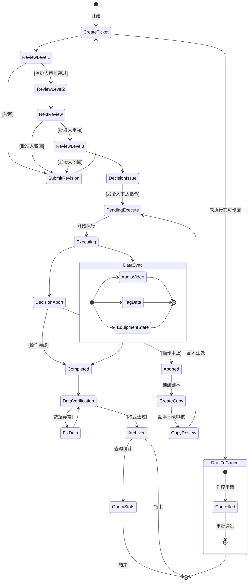
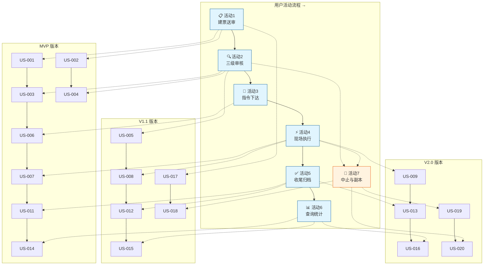
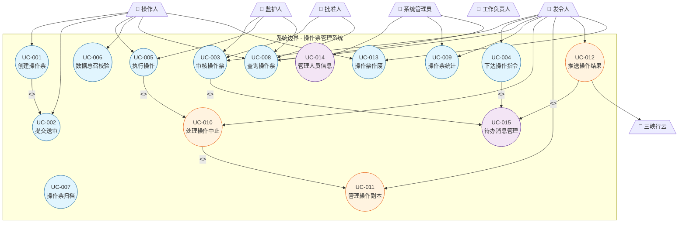
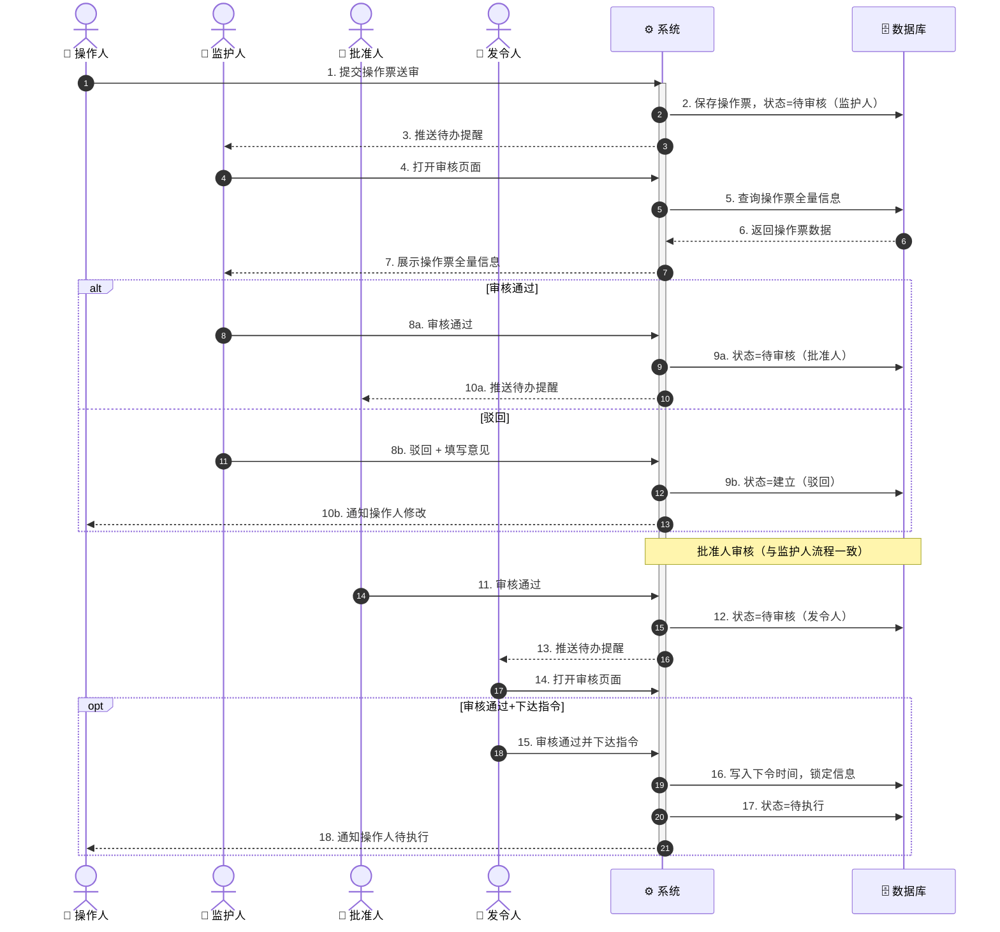
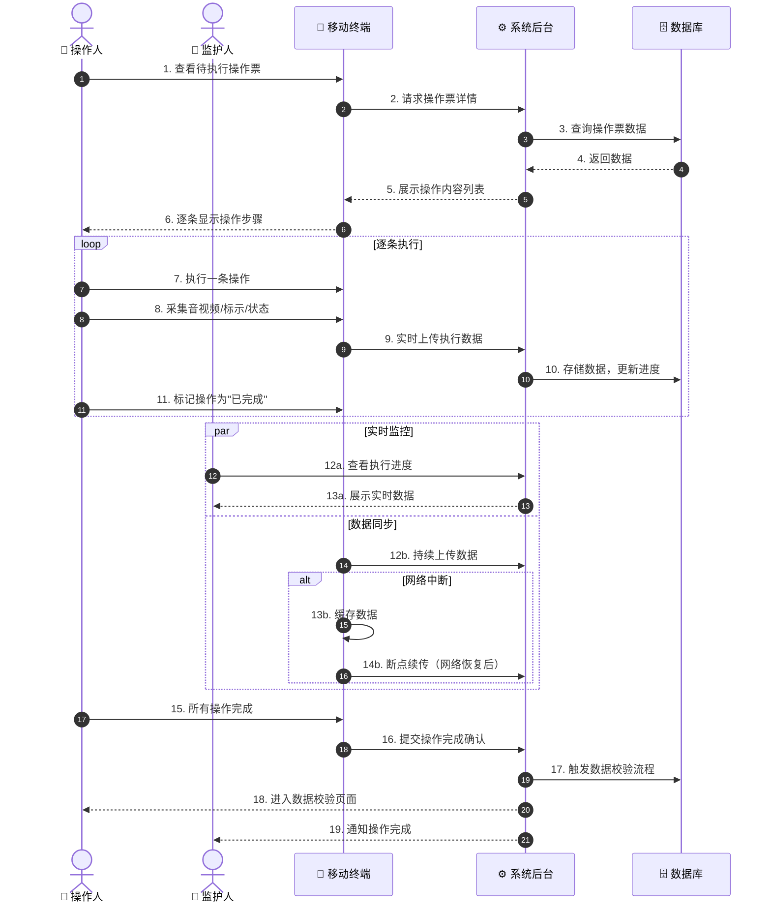
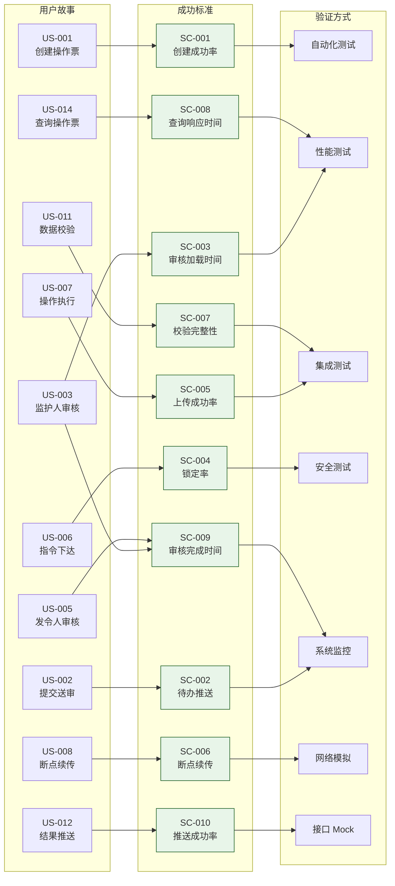
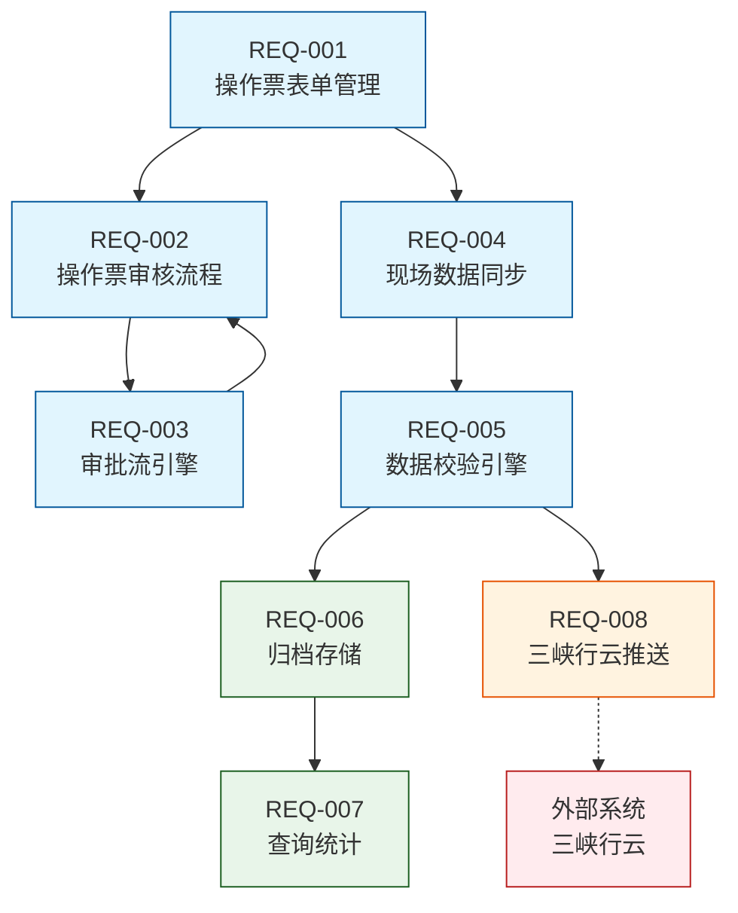

# 需求分析：操作票管理系统

**创建时间**：2026-05-13
**状态**：分析中

---

## 1. 用户角色画像

| 角色 | 描述 | 核心目标 |
|------|------|----------|
| **操作人** | 现场执行操作任务的作业人员，在PC/移动端发起建票、执行操作、上传现场数据 | 高效建票、准确执行操作、完整上传现场数据 |
| **监护人** | 对操作人作业进行全程监护的人员，负责操作票审核和现场安全监督 | 严格审核操作票、现场监护作业安全、确保数据完整 |
| **批准人** | 具有批准权限的管理人员，作为二级审核节点对操作票进行审批 | 把控操作票质量、确保操作合规性 |
| **发令人** | 下达操作指令的调度人员，负责最终审核、指令下达、操作管控及任务交接 | 准确下达指令、实时监控操作过程、处理异常与交接 |
| **工作负责人** | 关联工作票的责任人，接收操作结果推送 | 及时获取操作结果及安措关联信息 |

---

---

## 1. User Personas

| Persona | Description | Key Goals |
|---------|-------------|-----------|
| [Persona 1] | [Brief description] | [Primary goals] |
| [Persona 2] | [Brief description] | [Primary goals] |

---

## 2. 核心用户活动流

### 活动图（UML 活动图）



### 活动详情

| 活动 | 描述 | 输入 | 输出 | 参与角色 |
|------|------|------|------|----------|
| **建票** | 操作人创建电子操作票，填写基础信息、操作内容等 | 操作任务信息、人员信息 | 待审核操作票 | 操作人 |
| **三级审核** | 监护人→批准人→发令人依次审核操作票 | 待审核操作票 | 审核通过/驳回结果 | 监护人、批准人、发令人、操作人 |
| **指令下达** | 发令人审核通过后下达操作指令 | 审核通过的操作票 | 待执行操作票 | 发令人 |
| **现场执行** | 操作人现场操作，实时上传数据 | 操作指令 | 音视频、标示、设备数据 | 操作人、监护人 |
| **收尾校验** | 操作完成后全量数据总召校验 | 操作过程数据 | 校验结果 | 系统、操作人、监护人 |
| **归档** | 结构化存档，PDF生成 | 全量操作数据 | 归档记录 | 系统 |
| **中止处理** | 中止操作、标记未执行内容、创建副本 | 中止请求 | 中止操作票、副本 | 发令人、操作人 |
| **查询统计** | 按权限查询、统计操作票数据 | 查询条件 | 查询/统计结果 | 全角色 |

---

## 3. 用户故事地图

### 用户活动（从左到右为用户流程）



### 版本规划

| 活动 | MVP（P0） | V1.1（P1） | V2.0（P2） |
|------|-----------|------------|------------|
| **① 建票送审** | US-001 建票, US-002 送审 | US-017 暂存续编 | - |
| **② 三级审核** | US-003 监护人审核, US-004 批准人审核 | US-005 发令人审核 | - |
| **③ 指令下达** | US-006 指令下达与锁定 | - | - |
| **④ 现场执行** | US-007 操作执行与数据上传 | US-008 断点续传 | US-009 操作中止 |
| **⑤ 收尾归档** | US-011 数据总召校验 | US-012 结果推送(三峡行云) | US-013 PDF归档 |
| **⑥ 查询统计** | US-014 操作票查询 | US-015 操作票统计 | US-016 对外数据接口 |
| **⑦ 中止与副本** | - | US-018 副本创建与交接 | US-019 副本审核, US-020 副本执行 |

---

## 4. 用户故事

### 活动1：建票送审

#### US-001：创建电子操作票

**优先级**：P0
**角色**：操作人
**版本**：MVP

**故事**：
> 作为一名**操作人**，
> 我希望在**PC/移动端（同一套响应式Web系统）**创建电子操作票，填写基础信息、操作内容、危险源/工器具列表，
> 以便**规范记录操作任务，提交后续审核流程**。

**验收条件**：

```gherkin
Scenario: 成功创建操作票
  Given 操作人已登录系统
  When 操作人填写操作票表单（基础信息、操作内容、危险源、工器具）
  Then 系统自动实时保存每一字段变更，无需手动操作
  And 操作票初始状态为"建立"

Scenario: 票号自动生成
  Given 操作人进入建票页面
  Then 系统自动生成唯一票号

Scenario: 关联工作票
  When 操作人输入工作票号
  Then 系统自动关联该工作票的安措内容

Scenario: 意外关闭后恢复
  Given 操作人正在编辑操作票
  When 意外关闭页面或切换设备
  Then 重新打开后自动恢复上次编辑内容
```

**INVEST 检查**：
- [x] **I**ndependent（独立）
- [x] **N**egotiable（可协商）
- [x] **V**aluable（有价值）
- [x] **E**stimable（可估算）
- [ ] **S**mall（偏大，建议拆分）
- [x] **T**estable（可测试）

#### US-002：提交送审

**优先级**：P0
**角色**：操作人
**版本**：MVP

**故事**：
> 作为一名**操作人**，
> 我希望**提交操作票送审**，推送给下一级审核人，
> 以便**启动审核流程**。

**验收条件**：

```gherkin
Scenario: 提交送审成功
  Given 操作票信息已完整填写
  When 操作人点击"提交送审"按钮
  Then 系统将操作票状态更新为"待审核（监护人）"
  And 系统向监护人推送待办提醒
  And 操作票变为只读（审核人除外）

Scenario: 提交时信息不完整
  Given 操作票必填信息未填写完整
  When 操作人点击"提交送审"按钮
  Then 系统提示"请完善必填信息"，不提交
```

**INVEST 检查**：
- [ ] **I**ndependent（依赖 US-001 建票）
- [x] **N**egotiable（可协商）
- [x] **V**aluable（有价值）
- [x] **E**stimable（可估算）
- [x] **S**mall（单一操作，范围小）
- [x] **T**estable（可测试）

---

### 活动2：三级审核

#### US-003：监护人审核操作票

**优先级**：P0
**角色**：监护人
**版本**：MVP

**故事**：
> 作为一名**监护人**，
> 我希望**审核操作人提交的操作票**，查看全量信息并可编辑修改，审核通过或驳回，
> 以便**确保操作票内容完整准确，具备操作条件**。

**验收条件**：

```gherkin
Scenario: 监护人审核通过
  Given 操作票状态为"待审核（监护人）"
  When 监护人审核信息无误，点击"审核通过"
  Then 系统推送操作票至批准人
  And 操作票状态更新为"待审核（批准人）"

Scenario: 监护人驳回
  Given 操作票状态为"待审核（监护人）"
  When 监护人发现信息有误，点击"驳回"并填写驳回意见
  Then 系统退回操作票至操作人
  And 操作票状态更新为"建立（驳回）"

Scenario: 监护人编辑操作票
  Given 监护人正在审核操作票
  When 监护人对操作内容进行编辑修改
  Then 系统保存修改内容
```

**INVEST 检查**：
- [ ] **I**ndependent（依赖 US-002 提交送审）
- [x] **N**egotiable（可协商）
- [x] **V**aluable（有价值）
- [x] **E**stimable（可估算）
- [ ] **S**mall（含通过/驳回/编辑三种场景，偏大）
- [x] **T**estable（可测试）

#### US-004：批准人审核操作票

**优先级**：P0
**角色**：批准人
**版本**：MVP

**故事**：
> 作为一名**批准人**，
> 我希望**审核监护人通过的操作票**，
> 以便**从管理角度把控操作票合规性**。

**验收条件**：

```gherkin
Scenario: 批准人审核通过
  Given 操作票状态为"待审核（批准人）"
  When 批准人审核通过
  Then 系统推送操作票至发令人
  And 操作票状态更新为"待审核（发令人）"

Scenario: 批准人驳回
  Given 操作票状态为"待审核（批准人）"
  When 批准人驳回并填写意见
  Then 系统退回操作人，状态更新为"建立（驳回）"
```

**INVEST 检查**：
- [ ] **I**ndependent（依赖 US-003 监护人审核通过）
- [x] **N**egotiable（可协商）
- [x] **V**aluable（有价值）
- [x] **E**stimable（可估算）
- [x] **S**mall（仅通过/驳回，场景少）
- [x] **T**estable（可测试）

#### US-005：发令人审核操作票

**优先级**：P1
**角色**：发令人
**版本**：V1.1

**故事**：
> 作为一名**发令人**，
> 我希望**最终审核操作票全量信息**，
> 以便**在确认无误后下达操作指令**。

**验收条件**：

```gherkin
Scenario: 发令人审核通过
  Given 操作票状态为"待审核（发令人）"
  When 发令人审核通过
  Then 页面展示"下达操作指令"按钮

Scenario: 发令人驳回
  Given 操作票状态为"待审核（发令人）"
  When 发令人驳回并填写意见
  Then 系统退回操作人，状态更新为"建立（驳回）"
```

**INVEST 检查**：
- [ ] **I**ndependent（依赖 US-004 批准人审核通过）
- [x] **N**egotiable（可协商）
- [x] **V**aluable（有价值）
- [x] **E**stimable（可估算）
- [x] **S**mall（仅通过/驳回，与 US-003/004 模式一致）
- [x] **T**estable（可测试）

---

### 活动3：指令下达

#### US-006：下达操作指令与锁定

**优先级**：P0
**角色**：发令人
**版本**：MVP

**故事**：
> 作为一名**发令人**，
> 我希望**下达操作指令，系统自动写入下令时间并锁定操作票所有信息**，
> 以便**操作票正式生效进入待执行状态，无人可以修改**。

**验收条件**：

```gherkin
Scenario: 成功下达指令
  Given 发令人已审核通过操作票
  When 发令人点击"下达操作指令"按钮
  Then 系统自动写入当前时间为"下令时间"
  And 操作票所有信息被锁定（不可编辑）
  And 操作票状态更新为"待执行"
  And 系统向操作人推送待执行通知

Scenario: 指令下达后操作票只读
  Given 操作票状态为"待执行"
  When 任何角色尝试编辑操作票
  Then 系统禁止编辑操作
```

**INVEST 检查**：
- [ ] **I**ndependent（依赖 US-005 审核通过）
- [x] **N**egotiable（可协商）
- [x] **V**aluable（有价值）
- [x] **E**stimable（可估算）
- [x] **S**mall（单操作+锁定，范围小）
- [x] **T**estable（可测试）

---

### 活动4：现场执行

#### US-007：操作执行与数据实时上传

**优先级**：P0
**角色**：操作人
**版本**：MVP

**故事**：
> 作为一名**操作人**，
> 我希望**按操作内容逐条执行操作，并实时上传音视频、标示、设备状态数据**，
> 以便**同步记录操作执行过程，确保数据可追溯**。

**验收条件**：

```gherkin
Scenario: 开始执行操作
  Given 操作票状态为"待执行"
  When 操作人开始第一项操作
  Then 操作票状态更新为"执行中"

Scenario: 逐条标记执行状态
  When 操作人完成一条操作内容
  Then 系统标记该条操作为"已完成"

Scenario: 实时数据上传
  When 操作人执行操作过程中
  Then 音视频、标示、设备状态数据实时同步至系统后台

Scenario: 监护人实时监控
  Given 操作人正在执行操作
  When 监护人打开监控页面
  Then 监护人可查看操作执行状态和数据上传进度
```

**INVEST 检查**：
- [ ] **I**ndependent（依赖 US-006 指令下达）
- [x] **N**egotiable（可协商）
- [x] **V**aluable（有价值）
- [ ] **E**stimable（数据上传技术复杂度高，不确定性大）
- [ ] **S**mall（含执行标记+数据上传+监控，偏大）
- [x] **T**estable（可测试，但数据上传需模拟环境）

#### US-008：数据断点续传

**优先级**：P1
**角色**：操作人
**版本**：V1.1

**故事**：
> 作为一名**操作人**，
> 我希望**在网络中断后自动恢复数据上传，支持断点续传**，
> 以便**避免重复上传和现场数据丢失**。

**验收条件**：

```gherkin
Scenario: 网络恢复后续传
  Given 操作执行中网络中断，部分数据未上传
  When 网络恢复
  Then 系统自动从断点处继续上传未完成的数据
  And 不重复上传已成功的数据

Scenario: 数据完整性检查
  Given 断点续传完成后
  Then 系统校验已上传数据是否完整
```

**INVEST 检查**：
- [ ] **I**ndependent（依赖 US-007 数据上传）
- [x] **N**egotiable（断点续传策略可协商）
- [x] **V**aluable（有价值）
- [ ] **E**stimable（技术方案复杂度不确定性高）
- [x] **S**mall（单功能——断点续传，本地缓存+断点检测+续传恢复均为其子环节）
- [ ] **T**estable（网络中断模拟测试环境搭建复杂）

---

### 活动5：收尾归档

#### US-011：数据总召与一致性校验

**优先级**：P0
**角色**：系统、操作人
**版本**：MVP

**故事**：
> 作为一名**操作人**，
> 我希望**操作结束后系统自动进行全量数据总召和一致性校验**，
> 以便**确保现场终端数据与系统后台数据一致，修复数据异常**。

**验收条件**：

```gherkin
Scenario: 数据校验成功
  Given 操作执行完毕
  When 系统执行数据总召校验
  Then 所有数据一致，无异常
  And 系统允许进入归档步骤

Scenario: 数据异常修复
  Given 校验发现数据不一致
  When 系统标记异常数据
  Then 操作人可点击"重新上传"修复异常
  And 修复后重新校验
```

**INVEST 检查**：
- [ ] **I**ndependent（依赖 US-007 执行完成）
- [x] **N**egotiable（校验规则和异常处理可协商）
- [x] **V**aluable（有价值）
- [x] **E**stimable（数据对比逻辑明确）
- [x] **S**mall（单功能——全量数据校验，成功与异常修复是统一流程的两个分支）
- [x] **T**estable（可构造数据对比验证）

#### US-012：操作结果推送（三峡行云）

**优先级**：P1
**角色**：发令人、系统
**版本**：V1.1

**故事**：
> 作为一名**发令人**，
> 我希望**系统自动将操作结果及关联的工作票安措内容推送给工作负责人**，
> 以便**相关工作负责人及时了解操作完成情况**。

**验收条件**：

```gherkin
Scenario: 成功推送操作结果
  Given 数据校验通过
  When 系统调用三峡行云接口
  Then 向工作负责人推送操作结果（含影像、安措内容）
  And 记录推送状态

Scenario: 推送失败处理
  Given 接口调用失败
  Then 系统记录失败日志
  And 支持手动重新推送
```

**INVEST 检查**：
- [ ] **I**ndependent（依赖 US-011 校验通过）
- [x] **N**egotiable（推送方式、重试策略可协商）
- [x] **V**aluable（有价值）
- [ ] **E**stimable（依赖外部接口，估算不确定性高）
- [x] **S**mall（单功能——结果推送，复杂度来自外部依赖而非功能范围）
- [ ] **T**estable（依赖外部系统，测试需 mock）

#### US-013：PDF归档文档生成

**优先级**：P2
**角色**：系统
**版本**：V2.0

**故事**：
> 作为一名**系统**，
> 我希望**将操作票全量信息结构化存档并生成PDF工单文档**，
> 以便**操作票数据长期保存，支持查阅和审计**。

**验收条件**：

```gherkin
Scenario: 成功归档
  Given 数据校验通过
  When 系统执行归档流程
  Then 结构化数据存入数据库
  And 生成PDF文档
  And 操作票状态更新为"已完成"
  And 记录归档时间
```

**INVEST 检查**：
- [x] **I**ndependent（归档模块可独立开发）
- [x] **N**egotiable（PDF格式、内容布局可协商）
- [x] **V**aluable（有价值）
- [x] **E**stimable（PDF生成技术成熟）
- [x] **S**mall（单功能点）
- [x] **T**estable（可校验生成的PDF内容）

---

### 活动6：查询统计

#### US-014：操作票多条件查询

**优先级**：P0
**角色**：操作人、监护人、批准人、发令人
**版本**：MVP

**故事**：
> 作为一名**系统用户**，
> 我希望**按票号、操作人、时间、状态等多条件查询操作票**，
> 以便**快速定位所需操作票信息**。

**验收条件**：

```gherkin
Scenario: 多条件查询
  Given 用户登录系统
  When 输入查询条件（票号/操作人/时间范围/状态等）
  Then 系统返回符合条件的操作票列表
  And 支持模糊查询

Scenario: 查看详情
  Given 查询结果列表展示
  When 用户点击某操作票
  Then 展示操作票全量信息详情
```

**INVEST 检查**：
- [x] **I**ndependent（查询功能相对独立）
- [x] **N**egotiable（查询条件组合可协商）
- [x] **V**aluable（有价值）
- [x] **E**stimable（数据库查询模式明确）
- [x] **S**mall（单功能——标准列表搜索，多条件筛选是统一功能入口的不同参数组合）
- [x] **T**estable（查询结果可验证）

#### US-015：操作票统计

**优先级**：P1
**角色**：发令人、管理人员
**版本**：V1.1

**故事**：
> 作为一名**管理人员**，
> 我希望**按班组、人员、时间、任务类型等维度统计操作票数据**，
> 以便**掌握操作任务执行情况，辅助管理决策**。

**验收条件**：

```gherkin
Scenario: 统计展示
  Given 用户进入统计页面
  When 选择统计维度（班组/人员/时间/状态）
  Then 系统以图表格式展示统计数据（柱状图/饼图）
  And 支持导出统计报表
```

**INVEST 检查**：
- [x] **I**ndependent（统计功能相对独立）
- [x] **N**egotiable（统计维度和图表类型可协商）
- [x] **V**aluable（有价值）
- [x] **E**stimable（统计逻辑明确）
- [x] **S**mall（单功能——统计看板，多维度+图表+导出属于同一模块的不同呈现方式）
- [x] **T**estable（统计结果可验证）

#### US-016：归档数据对外接口

**优先级**：P2
**角色**：系统
**版本**：V2.0

**故事**：
> 作为一名**系统管理员**，
> 我希望**提供标准化的归档数据查询接口**，
> 以便**外部系统或用户按授权查询、调用归档操作票数据**。

**INVEST 检查**：
- [x] **I**ndependent（接口可独立设计实现）
- [x] **N**egotiable（接口规范、认证方式可协商）
- [x] **V**aluable（有价值）
- [ ] **E**stimable（接口标准需协调，不确定性高）
- [x] **S**mall（单功能——提供归档查询接口，接口设计+文档+实现是常规开发流程）
- [x] **T**estable（接口测试可行）

---

### 活动7：中止与副本

#### US-017：操作中止与标记

**优先级**：P0
**角色**：发令人
**版本**：MVP（核心路径已包含）

**故事**：
> 作为一名**发令人**，
> 我希望**在需要中止操作时标记未执行内容并添加备注**，
> 以便**准确记录中止状态和处理过程**。

**INVEST 检查**：
- [ ] **I**ndependent（依赖 US-007 执行中状态）
- [x] **N**egotiable（中止流程细节可协商）
- [x] **V**aluable（有价值）
- [x] **E**stimable（中止流程逻辑明确）
- [x] **S**mall（单功能点）
- [ ] **T**estable（缺少验收条件，测试场景不明确）

#### US-018：操作任务副本创建与交接

**优先级**：P1
**角色**：发令人
**版本**：V1.1

**故事**：
> 作为一名**发令人**，
> 我希望**一键创建操作任务副本，标记已执行/未执行内容，并移交下一班发令人**，
> 以便**未完成的操作任务可以无缝衔接**。

**验收条件**：

```gherkin
Scenario: 创建副本
  Given 操作票状态为"中止"
  When 发令人点击"创建副本"
  Then 系统生成副本操作票
  And 自动标记原票已执行/未执行内容
  And 分配副本票号

Scenario: 副本信息补充
  When 下一班人员打开副本
  Then 可补充新操作人、监护人、批准人信息
  And 可维护副本基础信息
```

**INVEST 检查**：
- [ ] **I**ndependent（依赖 US-017 中止状态）
- [x] **N**egotiable（副本数据继承范围可协商）
- [x] **V**aluable（有价值）
- [x] **E**stimable（数据复制+信息补充逻辑清晰）
- [x] **S**mall（单功能——副本创建管理，创建+标记+补充+交接是一个连贯的业务操作）
- [x] **T**estable（场景明确可测试）

#### US-019：副本三级审核

**优先级**：P2
**角色**：操作人、监护人、批准人、发令人
**版本**：V2.0

**故事**：
> 作为一名**操作人**，
> 我希望**副本操作票按标准流程完成三级审核后生效**，
> 以便**确保副本操作票的合规性和安全性**。

**INVEST 检查**：
- [ ] **I**ndependent（依赖 US-018 副本创建）
- [x] **N**egotiable（审核流程可复用标准三级审核）
- [x] **V**aluable（有价值）
- [x] **E**stimable（与标准审核流程类似，可复用）
- [x] **S**mall（可复用现有审核逻辑）
- [ ] **T**estable（缺少验收条件，需补充）

#### US-020：副本操作执行

**优先级**：P2
**角色**：操作人、监护人
**版本**：V2.0

**故事**：
> 作为一名**操作人**，
> 我希望**按副本操作票继续执行未完成的操作**，
> 以便**完成原操作任务中未完成的部分**。

**INVEST 检查**：
- [ ] **I**ndependent（依赖 US-019 审核通过）
- [x] **N**egotiable（执行方式可协商）
- [x] **V**aluable（有价值）
- [x] **E**stimable（与标准执行类似，可复用）
- [x] **S**mall（可复用现有执行逻辑）
- [ ] **T**estable（缺少验收条件，需补充）

---

## 5. 操作票作废流程

#### US-021：操作票作废

**优先级**：P1
**版本**：MVP（核心流程）

**故事**：
> 作为一名**操作人/相关负责人**，
> 我希望**在操作票未执行前申请作废操作票**，
> 以便**取消无需执行或错误的操作票**。

**验收条件**：

```gherkin
Scenario: 作废申请
  Given 操作票未执行
  When 操作人提交作废申请并填写作废原因
  Then 系统推送作废审批至发令人

Scenario: 作废审批通过
  Given 作废申请已提交
  When 发令人审批通过
  Then 操作票状态更新为"作废"
  And 记录作废人、作废时间、作废原因
  And 操作票不可编辑、不可执行

Scenario: 作废归档
  Given 操作票已作废
  Then 系统将作废票单独归档，纳入统计
```

**INVEST 检查**：
- [ ] **I**ndependent（依赖 US-001 建票，需有票才可作废）
- [x] **N**egotiable（作废审批流程可协商）
- [x] **V**aluable（有价值）
- [x] **E**stimable（作废流程明确）
- [x] **S**mall（单功能点）
- [x] **T**estable（场景明确可测试）

---

## 5. 用例图



### 用例列表

| 用例ID | 名称 | 主要参与者 | 优先级 | 描述 |
|--------|------|-----------|--------|------|
| **UC-001** | 创建操作票 | 操作人 | P0 | 在PC/移动端填写并创建电子操作票 |
| **UC-002** | 提交送审 | 操作人 | P0 | 提交操作票进入审核流程 |
| **UC-003** | 审核操作票 | 监护人/批准人/发令人 | P0 | 三级审核操作票，支持通过/驳回 |
| **UC-004** | 下达操作指令 | 发令人 | P0 | 审核通过后下达指令，锁定操作票 |
| **UC-005** | 执行操作 | 操作人 | P0 | 现场逐条执行操作，实时上传数据 |
| **UC-006** | 数据总召校验 | 操作人/系统 | P0 | 操作结束后全量数据一致性校验 |
| **UC-007** | 操作票归档 | 系统 | P1 | 结构化存档并生成PDF文档 |
| **UC-008** | 查询操作票 | 全角色 | P0 | 多条件查询操作票信息 |
| **UC-009** | 操作票统计 | 发令人/管理员 | P1 | 按维度统计操作票数据 |
| **UC-010** | 处理操作中止 | 发令人 | P1 | 标记未执行内容，创建中止记录 |
| **UC-011** | 管理操作副本 | 发令人 | P1 | 创建副本、补充信息、交接 |
| **UC-012** | 推送操作结果 | 系统 | P1 | 通过三峡行云推送结果 |
| **UC-013** | 操作票作废 | 操作人/发令人 | P1 | 申请作废并审批 |
| **UC-014** | 管理人员信息 | 系统管理员 | P2 | 维护人员基础信息与权限 |
| **UC-015** | 待办消息管理 | 系统 | P0 | 审核节点自动推送待办提醒 |

---

## 6. 用例详情

### UC-003：审核操作票（核心用例）

#### 基本信息

| 字段 | 值 |
|------|-----|
| **用例ID** | UC-003 |
| **名称** | 审核操作票（三级审核） |
| **主要参与者** | 监护人 / 批准人 / 发令人 |
| **次要参与者** | 操作人（接收驳回结果） |
| **优先级** | P0 |

#### 主流程时序图 - 标准审核流程



#### 前置条件
1. 操作人已完成操作票填写并提交送审
2. 各级审核人已登录系统

#### 后置条件（成功）
1. 操作票审核通过，状态为"待执行"
2. 操作票信息已锁定，无人可修改
3. 系统已写入下令时间

#### 备选流程

**A1：审核信息编辑修改**
- **触发条件**：审核人发现操作票信息需修改
- **描述**：审核人在审核页面直接编辑操作票各区域信息（基础信息、操作内容、危险源、工器具），保存后再执行通过/驳回操作

**A2：驳回后重新提交**
- **触发条件**：审核人驳回操作票
- **描述**：操作人接收驳回通知，查看驳回意见，修改对应内容后重新提交送审

**A3：并发审核锁定**
- **触发条件**：同一审核级别的多个审核人同时打开同一操作票
- **描述**：
  1. 审核人A打开审核页面时，系统锁定该操作票，标记"审核人A正在审核"
  2. 审核人B打开同一操作票时，系统提示"该操作票正在被审核人A审核中，请稍后"
  3. 审核人A提交审核结果或关闭页面后，系统自动释放锁定
  4. 锁定超时机制：审核人打开页面后30分钟内无任何操作，系统自动释放锁定
- **业务规则**：
  - 锁定状态只影响同一审核级别的并发操作，不影响其他级别的审核人
  - 例如：监护人A正在审核时，不影响批准人打开操作票查看

#### 异常流程

**E1：审核超时**
- **触发条件**：审核人长时间未处理待办
- **系统响应**：系统记录超时日志，支持上级管理员重新分配审核人
- **恢复**：重新分配后，新审核人接收待办继续审核流程

---

### UC-005：执行操作（核心用例）

#### 基本信息

| 字段 | 值 |
|------|-----|
| **用例ID** | UC-005 |
| **名称** | 执行操作 |
| **主要参与者** | 操作人 |
| **次要参与者** | 监护人（现场监护）、系统（数据同步） |
| **优先级** | P0 |

#### 主流程时序图 - 操作执行与数据同步



#### 前置条件
1. 操作票状态为"待执行"
2. 操作人已到达现场

#### 后置条件（成功）
1. 所有操作内容已执行完毕
2. 现场数据实时同步至系统后台
3. 系统触发数据校验流程

#### 备选流程

**A1：操作中止**
- **触发条件**：现场需要中止操作
- **描述**：操作人在移动端点击"操作中止申请"，发令人确认后系统标记未执行内容、添加备注，操作票状态置为"中止"，可创建副本

#### 异常流程

**E1：数据上传失败**
- **触发条件**：现场网络中断导致数据上传失败
- **系统响应**：移动端缓存数据，标记未上传数据
- **恢复**：网络恢复后自动断点续传，修复异常数据

---

### UC-010：处理操作中止

#### 基本信息

| 字段 | 值 |
|------|-----|
| **用例ID** | UC-010 |
| **名称** | 处理操作中止 |
| **主要参与者** | 发令人 |
| **次要参与者** | 操作人（发起中止）、监护人 |
| **优先级** | P1 |

#### 主流程时序图 - 操作中止与副本创建

```mermaid
sequenceDiagram
    autonumber

    actor Operator as 👤 操作人
    actor Dispatcher as 👤 发令人
    participant System as ⚙️ 系统
    participant DB as 🗄️ 数据库

    Operator->>System: 1. 发起操作中止申请
    System->>DB: 2. 记录中止申请
    System-->>Dispatcher: 3. 推送中止确认待办

    Dispatcher->>System: 4. 打开中止处理页
    System->>DB: 5. 查询当前操作状态
    DB-->>System: 6. 返回已执行/未执行列表
    System-->>Dispatcher: 7. 展示操作执行进度

    Dispatcher->>System: 8. 确认中止
    System->>DB: 9. 标记未执行操作内容
    Dispatcher->>System: 10. 填写中止备注
    System->>DB: 11. 保存中止记录
    System->>DB: 12. 状态=中止

    opt 创建副本
        Dispatcher->>System: 13. 点击"创建副本"
        System->>DB: 14. 生成副本操作票
        System->>DB: 15. 标记已执行/未执行内容
        System-->>Dispatcher: 16. 副本创建成功，进入副本管理
    end

    deactivate System
    System-->>Operator: 17. 通知操作人中止完成
```

---

## 7. 成功标准

### 成功标准概览

| 标准ID | 关联需求 | 分类 | 指标 | 目标值 | 验证方式 |
|--------|---------|------|------|--------|----------|
| **SC-001** | US-001 | 功能性 | 操作票创建成功率 | ≥ 99.5% | 自动化测试 |
| **SC-002** | US-002 | 功能性 | 送审后待办推送成功率 | 100% | 系统日志 |
| **SC-003** | US-003 | 性能 | 审核页面加载时间 | ≤ 2秒 | 性能测试 |
| **SC-004** | US-006 | 功能性 | 命令下达后信息锁定率 | 100% | 校验测试 |
| **SC-005** | US-007 | 功能性 | 现场数据实时上传成功率 | ≥ 99% | 数据一致性校验 |
| **SC-006** | US-008 | 可靠性 | 断点续传成功率 | ≥ 99.9% | 网络中断模拟 |
| **SC-007** | US-011 | 功能性 | 数据总召校验完整性 | 100%覆盖 | 全量对比 |
| **SC-008** | US-014 | 性能 | 多条件查询响应时间 | ≤ 3秒 | 性能测试 |
| **SC-009** | UC-003 | 业务 | 三级审核平均完成时间 | ≤ 24小时 | 系统统计 |
| **SC-010** | US-012 | 功能性 | 操作结果推送成功率 | ≥ 99% | 接口监控 |

### SC-001：操作票创建成功率

| 字段 | 值 |
|------|-----|
| **关联需求** | US-001（创建电子操作票） |
| **分类** | 功能性 |
| **指标** | 操作票创建成功率 = 成功创建数 / 创建请求总数 |
| **目标值** | ≥ 99.5% |
| **基准线** | 无（新系统） |
| **测量方法** | 自动化测试覆盖所有创建路径 |
| **验证节点** | 开发阶段：单元测试; 测试阶段：全量回归 |

**成功定义**：
> 所有正常填写的操作票都能成功创建，票号唯一且正确存储。

**失败定义**：
> 操作票表单数据完整但创建失败，或票号重复，或数据丢失。

### SC-002：送审后待办推送成功率

| 字段 | 值 |
|------|-----|
| **关联需求** | US-002（提交送审） |
| **分类** | 功能性 |
| **指标** | 待办推送成功率 = 成功推送数 / 应推送总数 |
| **目标值** | 100% |
| **基准线** | 无（新系统） |
| **测量方法** | 系统日志记录每次推送操作及结果 |
| **验证节点** | 测试阶段：集成测试 |

**成功定义**：
> 每次送审操作都能准确向下一级审核人推送待办提醒，零丢失。

**失败定义**：
> 审核人未收到待办提醒，或推送内容错误。

### SC-003：审核页面加载时间

| 字段 | 值 |
|------|-----|
| **关联需求** | US-003（监护人审核操作票） |
| **分类** | 性能 |
| **指标** | 90 分位响应时间 |
| **目标值** | ≤ 2 秒 |
| **基准线** | 无（新系统） |
| **测量方法** | 性能测试工具模拟多用户并发打开审核页面 |
| **验证节点** | 测试阶段：性能测试 |

**成功定义**：
> 90% 的审核页面请求在 2 秒内完成加载，包含操作票全量信息。

**失败定义**：
> 页面加载超过 2 秒，或高并发场景下响应时间明显劣化。

### SC-004：命令下达后信息锁定率

| 字段 | 值 |
|------|-----|
| **关联需求** | US-006（下达操作指令与锁定） |
| **分类** | 功能性 |
| **指标** | 锁定后信息不可编辑率 |
| **目标值** | 100%（零例外） |
| **基准线** | 无 |
| **测量方法** | 锁定后尝试所有编辑入口，校验是否被阻止 |
| **验证节点** | 测试阶段：安全测试 |

**成功定义**：
> 发令人下达指令后，不允许任何角色（包括发令人自己）修改操作票任何字段。

**失败定义**：
> 锁定后存在任一入口可编辑操作票信息。

### SC-005：现场数据实时上传成功率

| 字段 | 值 |
|------|-----|
| **关联需求** | US-007（操作执行与数据实时上传） |
| **分类** | 功能性 |
| **指标** | 上传成功率 = 成功数据包 / 总数据包 |
| **目标值** | ≥ 99% |
| **测量方法** | 模拟现场操作，对比上传前后数据一致性 |
| **验证节点** | 测试阶段：集成测试 |

### SC-006：断点续传成功率

| 字段 | 值 |
|------|-----|
| **关联需求** | US-008（数据断点续传） |
| **分类** | 可靠性 |
| **指标** | 断点续传成功率 = 续传后数据完整数 / 续传总次数 |
| **目标值** | ≥ 99.9% |
| **基准线** | 无（新系统） |
| **测量方法** | 网络中断模拟：在不同阶段断开网络，恢复后校验数据完整性 |
| **验证节点** | 测试阶段：网络模拟测试 |

**成功定义**：
> 网络恢复后，所有未上传数据自动续传完成，无数据丢失或重复。

**失败定义**：
> 续传后数据不完整，或重复上传导致数据冗余。

### SC-007：数据总召校验完整性

| 字段 | 值 |
|------|-----|
| **关联需求** | US-011（数据总召与一致性校验） |
| **分类** | 功能性 |
| **指标** | 校验覆盖度 = 被校验数据项 / 应校验数据项总数 |
| **目标值** | 100% 覆盖 |
| **基准线** | 无（新系统） |
| **测量方法** | 全量数据对比：系统记录与现场终端记录逐项比对 |
| **验证节点** | 测试阶段：集成测试 |

**成功定义**：
> 所有操作相关数据（操作内容、音视频、标示、设备状态）均被纳入校验范围，一致性校验无遗漏。

**失败定义**：
> 存在数据项未被校验，或校验结果与实际不一致。

### SC-008：多条件查询响应时间

| 字段 | 值 |
|------|-----|
| **关联需求** | US-014（操作票多条件查询） |
| **分类** | 性能 |
| **指标** | 95 分位响应时间 |
| **目标值** | ≤ 3 秒 |
| **基准线** | 无（新系统） |
| **测量方法** | 性能测试工具构造多条件组合查询，模拟不同数据量级 |
| **验证节点** | 测试阶段：性能测试 |

**成功定义**：
> 95% 的查询请求在 3 秒内返回结果，支持模糊匹配和多条件组合。

**失败定义**：
> 查询响应超过 3 秒，或复杂组合查询导致超时。

### SC-009：三级审核平均完成时间

| 字段 | 值 |
|------|-----|
| **关联需求** | UC-003（审核操作票：监护人→批准人→发令人） |
| **分类** | 业务 |
| **指标** | 从提交送审到指令下达的平均总耗时 |
| **目标值** | ≤ 24 小时 |
| **基准线** | 无（新系统） |
| **测量方法** | 系统统计每张操作票各审核节点的时间戳，计算总流转时长 |
| **验证节点** | 试运行阶段：系统统计 |

**成功定义**：
> 操作票提交送审后，在 24 小时内完成全部三级审核并下达指令。

**失败定义**：
> 审核流转超过 24 小时，或存在长期滞留未被审核的操作票。

### SC-010：操作结果推送成功率

| 字段 | 值 |
|------|-----|
| **关联需求** | US-012（操作结果推送——三峡行云） |
| **分类** | 功能性 |
| **指标** | 推送成功率 = 成功推送次数 / 总推送次数 |
| **目标值** | ≥ 99% |
| **基准线** | 无（新系统） |
| **测量方法** | 接口监控：记录每次推送请求及响应状态；失败时自动重试并告警 |
| **验证节点** | 测试阶段：接口 Mock 测试; 运行阶段：接口监控 |

**成功定义**：
> 数据校验通过后，系统自动向三峡行云推送操作结果，推送成功率高，失败可自动重试。

**失败定义**：
> 推送失败且未触发重试，或重试后仍未成功且无告警。

### 成功标准追溯图



---

## 8. 依赖分析

### 依赖关系图



### 依赖矩阵

| 需求ID | 依赖项 | 依赖类型 | 延迟影响 |
|--------|--------|----------|----------|
| **REQ-002（审核流程）** | REQ-001（表单管理） | 强制性 | 无法启动审核流程 |
| **REQ-003（审批流引擎）** | REQ-002（审核流程） | 强制性 | 无法实现三级审核 |
| **REQ-004（现场数据同步）** | REQ-001（表单管理） | 强制性 | 无法关联数据到操作票 |
| **REQ-005（数据校验引擎）** | REQ-004（数据同步） | 强制性 | 无法验证数据完整性 |
| **REQ-006（归档存储）** | REQ-005（数据校验） | 强制性 | 无法归档 |
| **REQ-007（查询统计）** | REQ-006（归档存储） | 强制性 | 查询结果不完整 |
| **REQ-008（三峡行云推送）** | REQ-005（数据校验） | 强制性+外部 | 高风险，依赖外部接口 |
| **REQ-003（审批流引擎）** | 无 | 基础组件 | 可并行开发 |

### 关键路径

| 步骤 | 需求ID | 需求 | 依赖 | 风险 |
|------|--------|------|------|------|
| 1 | REQ-001 | 操作票表单管理 | - | 入口需求，基础功能 |
| 2 | REQ-002 | 操作票审核流程 | REQ-001 | 核心业务流程 |
| 3 | REQ-003 | 审批流引擎 | REQ-002 | 复杂的状态流转 |
| 4 | REQ-004 | 现场数据同步 | REQ-001 | 移动端通信稳定性 |
| 5 | REQ-005 | 数据校验引擎 | REQ-004 | 数据一致性保证 |
| 6 | REQ-006 | 归档存储 | REQ-005 | **阻塞上线** |
| 7 | REQ-008 | 三峡行云推送 | REQ-005 + 外部API | **高风险外部依赖** |

**路径总结**：
- **主路径**：`REQ-001 → REQ-002 → REQ-003 → REQ-005 → REQ-006`
- **并行路径**：`REQ-004 → REQ-005`（可与主路径并行）
- **瓶颈**：REQ-005（数据校验引擎）- 连接多个下游依赖，复杂度高
- **外部风险**：REQ-008（三峡行云推送）- 依赖外部接口可用性和稳定性

---

## 9. 可行性评估

| 需求 | 技术可行性 | 风险等级 | 说明 |
|------|-----------|----------|------|
| **操作票表单管理** | 高 | 低 | 标准CRUD操作，PC/移动端表单技术成熟 |
| **三级审核流程** | 高 | 低 | 经典审批流模式，有成熟的审批引擎参考 |
| **审批流引擎** | 中 | 中 | 状态机设计和流转逻辑较复杂，需设计好状态表 |
| **现场数据实时同步** | 中 | 中 | 需处理网络中断、数据冲突，需断点续传机制 |
| **断点续传** | 中 | 中 | 需设计数据分片、校验、续传逻辑 |
| **数据总召校验** | 高 | 低 | 数据对比逻辑明确，复杂度可控 |
| **PDF文档生成** | 高 | 低 | 成熟的PDF生成方案可用 |
| **三峡行云推送** | 中 | 高 | 依赖外部系统接口，接口规范和数据格式需协调 |
| **操作票副本管理** | 中 | 中 | 数据复制和状态继承逻辑需仔细设计 |
| **多条件查询统计** | 高 | 低 | 标准数据库查询，索引优化即可 |
| **角色权限管控** | 高 | 低 | RBAC模型成熟方案 |

---

## 10. 非功能性需求（NFR）

### NFR 概览

| 分类 | 数量 | 优先级分布 |
|------|------|------------|
| 性能 | 3 | P0: 2, P1: 1 |
| 安全 | 3 | P0: 3 |
| 可靠性 | 3 | P0: 2, P1: 1 |
| 可用性 | 2 | P0: 1, P1: 1 |
| 可扩展性 | 2 | P1: 2 |
| 可维护性 | 3 | P0: 1, P1: 2 |
| 兼容性 | 2 | P0: 1, P1: 1 |

### 性能需求

| NFR编号 | 需求描述 | 指标 | 目标值 | 关联功能 |
|---------|---------|------|--------|----------|
| NFR-P01 | 操作票审核页面加载时间 | 90分位响应时间 | ≤ 2秒 | UC-003 |
| NFR-P02 | 多条件查询响应时间 | 95分位响应时间 | ≤ 3秒 | US-014 |
| NFR-P03 | 实时数据上传延迟 | 端到端延迟 | ≤ 5秒（正常网络） | US-007 |

### 安全需求

| NFR编号 | 需求描述 | 指标 | 目标值 | 关联功能 |
|---------|---------|------|--------|----------|
| NFR-S01 | 角色权限管控 | 越权访问拦截率 | 100% | UC-014 |
| NFR-S02 | 操作票数据加密存储 | 加密标准 | AES-256 | 全系统 |
| NFR-S03 | 传输加密 | 通信协议 | TLS 1.3 | 全系统 |
| NFR-S04 | 操作日志审计 | 关键操作日志覆盖率 | 100% | 全系统 |
| NFR-S05 | 审核签章认证 | 签章不可篡改性 | 防篡改校验通过 | UC-003 |

### 可靠性需求

| NFR编号 | 需求描述 | 指标 | 目标值 | 关联功能 |
|---------|---------|------|--------|----------|
| NFR-R01 | 系统可用性 | 正常运行时间 | ≥ 99.9%（月） | 全系统 |
| NFR-R02 | 断点续传成功率 | 网络恢复后数据完整性 | 100%不丢数据 | US-008 |
| NFR-R03 | 数据定期备份 | 备份频率 | 每日全量，每小时增量 | 全系统 |
| NFR-R04 | 系统故障恢复时间 | RTO | ≤ 30分钟 | 全系统 |

### 可用性需求

| NFR编号 | 需求描述 | 指标 | 目标值 | 关联功能 |
|---------|---------|------|--------|----------|
| NFR-U01 | PC/移动端自适应 | 核心功能在PC和移动端均可完整操作 | 100%核心功能可用 | 全系统 |
| NFR-U02 | 操作引导与提示 | 关键操作节点的错误提示和引导覆盖率 | 100%覆盖 | 全系统 |

### 可扩展性需求

| NFR编号 | 需求描述 | 指标 | 目标值 | 关联功能 |
|---------|---------|------|--------|----------|
| NFR-SC01 | 并发用户支持 | 同时在线用户数 | ≥ 200人 | 全系统 |
| NFR-SC02 | 数据增长处理 | 操作票年增长量 | ≥ 10万张/年 | 归档、查询 |

### 可维护性需求

| NFR编号 | 需求描述 | 指标 | 目标值 | 关联功能 |
|---------|---------|------|--------|----------|
| NFR-M01 | 系统操作日志 | 关键操作日志记录率 | 100% | 全系统 |
| NFR-M02 | 日志保留期限 | 日志存储时间 | ≥ 90天 | 全系统 |
| NFR-M03 | 定时任务监控 | 归档、推送等定时任务执行监控 | 告警准确率 ≥ 99% | 归档、推送 |

### 兼容性需求

| NFR编号 | 需求描述 | 指标 | 目标值 | 关联功能 |
|---------|---------|------|--------|----------|
| NFR-C01 | 浏览器兼容 | 支持的浏览器 | Chrome/Firefox/Edge 最新2个版本 | 全系统 |
| NFR-C02 | 移动端兼容 | 移动端支持 | 移动端响应式 Web，iOS Safari / Android Chrome 最新2个版本 | 操作执行 |
| NFR-C03 | 移动端体验 | 移动端适配 | 操作执行页面在移动端完整可用，表单操作适配触屏交互 | 操作执行、建票 |

---

## 11. 分析更新日志（迭代用）

> **注意**：此部分仅在 `clarification.md` 或 `validation.md` 已存在时填写。

### 来自 clarification.md 的更新

| 问题编号 | 澄清摘要 | 应用范围 | 更新章节 |
|---------|---------|----------|---------|
| Q1 | 确认采用移动端响应式 Web（选项 B），同一套代码覆盖 PC/移动端 | NFR-C03 新增；US-001 描述更新 | NFR 兼容性需求；第4章 US-001 |
| Q2 | 确认先到先得+审核锁定（选项 B），30分钟超时自动释放 | UC-003 备选流程 A3 新增；BR-006 新增 | 第6章 UC-003 备选流程；业务规则 |
| Q3 | 确认严格角色互斥（选项 B），一人仅一个角色 | data-model.md 角色设计；权限校验逻辑 | 数据模型 |
| Q4 | 确认仅系统内通知（选项 A），无外部推送集成 | UC-003 待办提醒方式修改 | 第6章 UC-003 |
| Q5 | 确认移动端原生 App 不在范围内（选项 B），已采用响应式 Web | requirements.md 技术方案确认 | 第4章 US-001 技术方案 |
| Q6 | 确认数据库 BLOB 存储 + 永久保留（选项 A） | data-model.md media_url 字段设计 | 数据模型 |
| Q7 | 确认遵循电力行业通用操作票规范（选项 A），无需等保认证 | NFR 合规性补充行业规范要求 | NFR 合规性 |
| Q8 | 确认全自动实时保存（选项 C），每字段变更即保存 | US-001 暂存行为明确；去除"暂存"按钮 | 第4章 US-001 验收条件 |
| Q9 | 补充 US-017/019/020 验收条件 | US-017/019/020 → 新增 Gherkin 场景 | 第4章 操作中止、副本审核、副本执行 |
| Q10 | 分片上传 + IndexedDB 缓存技术方案 | US-007/008 → 采用分片上传策略；NFR-P03 调整 | 技术方案描述 |
| Q11 | **等待三峡行云提供接口文档后再开发** | US-012 → 开发启动条件变更为"接口文档就绪" | MVP 进度计划标注外部依赖风险 |
| Q12 | 拆分 US-001/003/007 为更小故事 | US-001/003/007 → 按功能边界拆分；版本规划表调整 | 用户故事地图；版本规划 |
| Q13 | 补充 US-016 验收条件 + 预定义接口规范 | US-016 → 新增验收条件；对外接口设计规范 | 第4章 US-016 |

### 来自 validation.md 的更新

| 问题编号 | 验证发现 | 应用范围 | 更新章节 |
|---------|---------|----------|---------|
| - | - | - | - |

### 迭代历史

| 版本 | 日期 | 触发条件 | 变更内容 |
|------|------|----------|----------|
| v1.0 | 2026-05-13 | 初始分析 | 从 PRD.md 创建 |

---

## 12. 分析总结

**识别的用户角色**：
- **操作人**（Operator）- 现场操作作业的核心执行者
- **监护人**（Supervisor）- 审核与现场监护
- **批准人**（Approver）- 管理审批节点
- **发令人**（Dispatcher）- 指令下达与操作管控
- **工作负责人**（Worker）- 结果接收方（外部关注者）
- **系统管理员**（Admin）- 人员与权限管理

**核心活动**：
1. **建票送审** - 操作人创建操作票并提交审核
2. **三级审核** - 监护人→批准人→发令人依次审核
3. **指令下达** - 发令人下达操作指令，锁定操作票
4. **现场执行** - 操作人逐条执行操作，实时数据同步
5. **收尾归档** - 数据校验、推送结果、归档存储
6. **查询统计** - 按权限查询和统计数据
7. **中止与副本** - 异常处理与任务交接

**关键发现**：
- **发现1**：系统核心是**状态机驱动**的审批流，操作票状态约7-8个（建立→待审核→待执行→执行中→中止→已完成→作废），每个状态迁移需要严格校验
- **发现2**：现场数据同步是技术难点，需处理网络中断、数据一致性、断点续传等场景
- **发现3**：三峡行云集成是外部依赖风险点，需设计推送失败重试和人工补救机制
- **发现4**：副本操作票实质是原操作票的**状态快照+续作**，需设计合理的数据继承模型
- **发现5**：角色权限管控贯穿全系统，每个页面和按钮都需按角色差异化展示

**已识别风险**：
- **风险1**：三峡行云外部接口的可用性和稳定性不可控
  - **缓解措施**：设计推送队列和重试机制，支持手动触发；与对方确认SLA
- **风险2**：现场网络环境复杂，数据上传可能中断
  - **缓解措施**：实现断点续传、本地缓存、数据校验修复机制
- **风险3**：操作票状态复杂，状态迁移可能遗漏边界情况
  - **缓解措施**：定义完整的状态机图，覆盖所有正常/异常路径

---

## 13. 相关工件

### 数据模型

> **参见**：`data-model.md` 完整数据结构定义

| 实体 | 描述 | 状态 |
|------|------|------|
| **电子操作票** | 核心实体，记录操作任务全量信息 | 已定义 |
| **操作人员** | 操作人基础信息 | 已定义 |
| **监护人员** | 监护人基础信息 | 已定义 |
| **批准人员** | 批准人基础信息 | 已定义 |
| **发令人员** | 发令人基础信息 | 已定义 |
| **操作任务副本** | 操作中止后的续作副本 | 已定义 |
| **危险源信息** | 关联的风险防控信息 | 已定义 |
| **工器具信息** | 操作所需工器具信息 | 已定义 |
| **工作票关联信息** | 关联工作票及安措信息 | 已定义 |
| **操作日志** | 操作过程审计日志 | 已定义 |

**数据模型包含**：
- 实体定义及属性
- 实体关系（ER图）
- 实体生命周期状态图
- 校验规则和约束
- 数据字典

---

## 14. 下一步

- [x] Phase 4：需求澄清（Clarification）- 13个问题已全部确认
- [ ] 将 Q12 的故事拆分方案落实到用户故事地图和版本规划
- [ ] 将 Q9/Q13 的验收条件补充到对应 US 章节
- [ ] 进入 Phase 5：需求验证（Validation）- 编写验证用例
- [ ] 如果迭代中：参考 `clarification.md`/`validation.md` 更新分析
