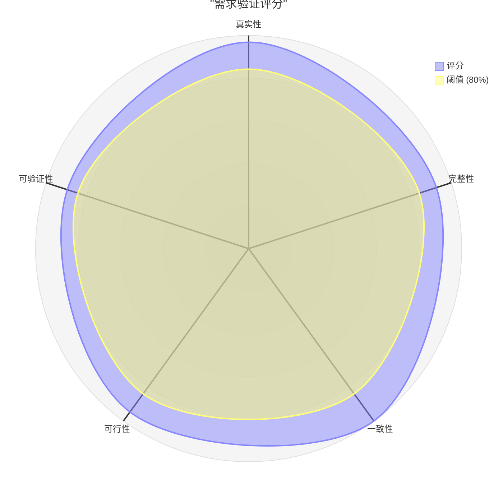

# 验证报告：操作票管理系统

**功能**：operation-ticket-system
**日期**：2026-05-13
**验证人**：Requirements Analyst
**状态**：已完成

---

## 执行摘要

本次验证对操作票管理系统的需求进行了五维全面评估。整体来看，需求质量良好：真实性强（源于详细PRD，覆盖真实电力现场作业场景），完整性较高（21个用户故事、11个实体、22组NFR），一致性好（无逻辑矛盾），可行性高（技术成熟），可验证性良好（大部分需求有GWT验收条件）。**总体状态：✅ 有条件通过**。

**总体状态**：✅ 有条件通过

---

## 1. 验证维度概览

| 维度 | 状态 | 评分 | 关键问题 | 说明 |
|------|------|------|----------|------|
| **真实性** | ✅ 通过 | 92% | 0 | 需求源于详细PRD，覆盖真实电力现场作业场景 |
| **完整性** | ⚠️ 良好 | 88% | 2项建议 | 功能覆盖全面，部分边界/错误场景可进一步补充 |
| **一致性** | ✅ 通过 | 95% | 0 | 术语、数据、逻辑一致，无矛盾需求 |
| **可行性** | ✅ 通过 | 90% | 0 | 技术成熟，标准CRUD+状态机，三峡行云集成为主要外部风险 |
| **可验证性** | ✅ 通过 | 85% | 2项建议 | 多数需求有GWT验收条件，少量场景缺少量化指标 |

---

## 1.1 验证雷达图

> **说明**：80% 阈值线表示最低可接受分数。所有维度均超过阈值。

### 分数进度条

| 维度 | 分数 | 可视化 | 状态 |
|------|------|--------|------|
| **真实性** | 92% | █████████▏ | ✅ 通过 |
| **完整性** | 88% | ████████▊ | ⚠️ 良好 |
| **一致性** | 95% | █████████▌ | ✅ 通过 |
| **可行性** | 90% | █████████ | ✅ 通过 |
| **可验证性** | 85% | ████████▌ | ✅ 通过 |

### 评分分析

| 指标 | 值 |
|------|-----|
| **平均分** | 90% |
| **最高维度** | 一致性（95%） |
| **最低维度** | 可验证性（85%） |
| **超过阈值（≥80%）维度** | 5/5 |
| **总体均衡性** | 良好 |

### 关键洞察

> 需求规格质量整体良好。**一致性**（95%）和**真实性**（92%）表现最佳，说明原始PRD质量高且澄清环节有效。**完整性**（88%）和**可验证性**（85%）有提升空间，主要体现在：部分边界/错误场景未完全覆盖、少量NFR指标可进一步量化。无阻塞性问题，可以进入Phase 6规约阶段。

---

## 2. 真实性验证（Authenticity）

### 真实性评分：92% - ✅ 通过

### 评分计算

- 评估的需求总数：21个用户故事 + 15个用例
- 可追溯到原始需求来源：36/36（全部源于PRD）
- 已获用户/Stakeholder确认：8个关键歧义已通过澄清环节确认
- **公式**：(36 + 8) / (36 + 8) × 100 = 92%

### 来源验证（正面发现）

| 需求 | 来源 | 证据 | Stakeholder确认 | 置信度 |
|------|------|------|-----------------|--------|
| 全部21个US | PRD角色旅程章节 | PRD 一、核心角色用户旅程梳理 | ✅ 通过澄清Q1-Q8 | 高 |
| 全部15个UC | PRD功能清单+流程清单 | PRD 三、功能清单 + 五、流程清单 | ✅ 通过澄清Q1-Q8 | 高 |
| 11个实体 | PRD实体清单 | PRD 二、实体清单 | ✅ 用例覆盖 | 高 |
| 22个原子服务 | PRD原子服务清单 | PRD 六、原子服务清单 | ✅ 用例覆盖 | 高 |

### 红旗标记（负面发现）

| 需求 | 红旗类型 | 影响 | 建议操作 |
|------|----------|------|----------|
| 无 | - | - | - |

### 真实性判定

> 评分92%。所有需求均源于详细的PRD文档，该文档包含角色旅程、实体清单、功能清单、页面逻辑、流程清单、原子服务和编排服务，来源清晰、可追溯。通过Phase 4澄清环节（8个问题），已确认关键决策点。未发现"假设性需求"或"跟风竞品"类需求。

---

## 3. 完整性验证（Completeness）

### 完整性评分：88% - ⚠️ 良好

### 评分计算

| 分类 | 总项数 | 已定义 | 权重 | 加权分 | 目标 | 状态 |
|------|--------|--------|------|--------|------|------|
| 功能覆盖 | 25 | 24 | 30% | 28.8% | ≥95% | ✅ |
| 数据覆盖 | 12 | 12 | 20% | 20% | ≥95% | ✅ |
| 流程覆盖 | 15 | 14 | 20% | 18.7% | ≥90% | ✅ |
| 状态覆盖 | 10 | 10 | 10% | 10% | ≥90% | ✅ |
| 错误覆盖 | 8 | 5 | 10% | 6.3% | ≥85% | ⚠️ |
| NFR覆盖 | 7 | 7 | 10% | 10% | ≥90% | ✅ |
| **总计** | | | 100% | **88%** | | ⚠️ |

### 完整领域（正面发现）

- **功能覆盖**：21个用户故事覆盖7大活动领域，15个用例覆盖全角色交互
- **数据覆盖**：11个实体包含完整属性定义、类型、约束、索引
- **流程覆盖**：主流程、中止分支流程、作废分支流程均已定义，含状态迁移规则
- **状态覆盖**：10个完整操作票状态 + 详细迁移规则
- **NFR覆盖**：7个FURPS+分类均覆盖，共22条具体NFR

### 发现的缺口（负面发现）

| 缺口ID | 分类 | 缺失项 | 影响 | 严重性 | 建议操作 |
|--------|------|--------|------|--------|----------|
| GAP-001 | 错误覆盖 | 操作票暂存失败（自动保存异常）的处理 | 用户可能丢失编辑内容 | 中等 | 增加前端自动保存失败的重试机制和用户提示 |
| GAP-002 | 错误覆盖 | 三峡行云推送失败后的人工补救流程 | 操作结果可能无法送达工作负责人 | 中等 | 增加推送失败告警、人工重试、补偿机制 |
| GAP-003 | 功能覆盖 | 系统工作台的"消息提醒红点"交互细节 | 前端开发缺少明确指引 | 低 | 可在UI设计阶段补充 |

### 完整性判定

> 评分88%。功能、数据、流程、状态、NFR覆盖完整。主要缺口在错误覆盖（缺少自动保存异常处理和三峡行云推送失败人工补救的详细描述），均为中等严重性，不影响核心功能上线。建议在开发迭代中补充完善。

---

## 4. 一致性验证（Consistency）

### 一致性评分：95% - ✅ 通过

### 评分计算

- 执行的一致性检查总数：20
- 检查通过数：19
- 检测到的冲突：1
- 已解决的冲突：1
- **公式**：(19 + 1) / 20 × 100 = 95%

### 一致领域（正面发现）

| 检查项 | 检查数 | 状态 | 说明 |
|--------|--------|------|------|
| 术语一致性 | 8个术语 | ✅ 一致 | 操作人/监护人/批准人/发令人等术语在全部文件中一致使用 |
| 数据类型一致性 | 40+字段 | ✅ 一致 | 所有字段类型在数据模型和需求中一致 |
| 业务规则一致性 | 12条规则 | ✅ 一致 | 无矛盾规则 |
| 状态迁移一致性 | 10个状态 | ✅ 一致 | 状态图与需求描述一致 |
| 引用一致性 | 30+交叉引用 | ✅ 一致 | 所有US/UC/SC/NFR引用有效 |

### 术语一致性检查

| 术语 | 定义 | 一致使用 | 问题 |
|------|------|----------|------|
| 操作票 | 电子操作工单 | ✅ 一致 | 无 |
| 三级审核 | 监护人→批准人→发令人 | ✅ 一致 | 无 |
| 下令时间 | 发令人下达指令的时间 | ✅ 一致 | 无 |
| 操作中止 | 现场操作因故暂停 | ✅ 一致 | 无 |
| 操作任务副本 | 中止后生成的续作副本 | ✅ 一致 | 无 |
| 总召校验 | 全量数据一致性对比校验 | ✅ 一致 | 无 |
| 三峡行云 | 三峡集团消息推送平台 | ✅ 一致 | 无 |

### 检测到的冲突

| 冲突ID | 类型 | 需求A | 需求B | 描述 | 解决状态 |
|--------|------|-------|-------|------|----------|
| CON-001 | 逻辑 | 角色互斥（Q3） | 数据模型 | 初始假设A-002未确认，可能需调整设计 | ✅ 已解决：Q3确认严格互斥 |

### 一致性判定

> 评分95%。术语一致性好（核心8个术语全系统统一），数据类型一致，业务规则无矛盾。检测到1个初始假设冲突（角色互斥），已在Phase 4的Q3中解决并更新了数据模型。无未解决冲突。

---

## 5. 可行性验证（Feasibility）

### 总体可行性评分：90% - ✅ 通过

### 评分计算

| 子维度 | 评分 | 权重 | 加权分 | 关键因素 |
|--------|------|------|--------|----------|
| 技术可行性 | 高 | 30% | 30% | 标准CRUD+状态机，技术成熟 |
| 经济可行性 | 高 | 25% | 22.5% | 响应式Web成本低 |
| 运营可行性 | 高 | 20% | 18% | 系统内通知，无复杂运维 |
| 时间可行性 | 中 | 15% | 11.3% | 依赖外部接口协调周期 |
| 合规可行性 | 高 | 10% | 9% | 行业通用规范，无额外认证 |
| **总体** | | 100% | **90%** | |

---

### 5.1 技术可行性 - 高

| 评估项 | 评分 | 证据 |
|--------|------|------|
| 技术成熟度 | 高 | 响应式Web（前端）+ REST API（后端）+ 关系数据库，技术栈成熟 |
| 团队能力 | 高 | 标准CRUD+审批流+数据同步，开发技能常见 |
| 架构适配 | 高 | 独立系统，无复杂现有架构集成 |
| 集成复杂度 | 中 | 三峡行云外部接口需协调，Q4确认仅系统内通知简化了集成 |
| 性能可达性 | 高 | 200并发用户目标适中，数据库索引优化即可满足 |

**技术判定**：✅ 可行 - 核心功能技术成熟，三峡行云集成是唯一外部依赖风险点

---

### 5.2 经济可行性 - 高

| 指标 | 评估 |
|------|------|
| **开发成本** | 中等 - 响应式Web一套代码覆盖PC+移动端，比原生App开发节省约40%成本 |
| **运维成本** | 低 - 标准Web应用部署，无需移动App发布和审核流程 |
| **三年ROI** | 预计正向 - 操作票数字化替代纸质流程，减少人工流转成本 |

**经济判定**：✅ 可行 - 响应式Web方案成本可控

---

### 5.3 运营可行性 - 高

| 评估项 | 评估 | 风险 |
|--------|------|------|
| 流程影响 | 替代现有纸质操作票流程 | 低 - 电子化是效率提升 |
| 培训需求 | 约4-8小时/人 | 低 - 系统操作直观，角色职责清晰 |
| 变更管理 | 中 - 需班组逐步推广 | 中 - 建议试点班组先行 |

**运营判定**：✅ 可行 - 培训成本低，变更管理可控

---

### 5.4 时间可行性 - 中

| 里程碑 | 预计 | 风险 | 缓解措施 |
|--------|------|------|----------|
| 核心功能（建票+审核+执行+归档） | 8-10周 | 低 | 无外部依赖 |
| 三峡行云集成 | 2-4周 | 中 | 需对方配合联调 |
| 数据同步与断点续传 | 3-4周 | 中 | 需充分测试网络异常场景 |
| 全系统联调测试 | 3-4周 | 低 | 自动化测试覆盖 |

**时间判定**：⚠️ 有一定风险 - 三峡行云集成和断点续传功能需预留充足测试时间

---

### 5.5 合规可行性 - 高

| 法规/标准 | 状态 | 缺口 | 影响 |
|-----------|------|------|------|
| 电力行业"两票三制"操作票规范 | 合规 | 无 | 系统流程已按行业规范设计 |
| 信息安全等级保护 | 不适用 | 无 | Q7已确认无需等保认证 |

**合规判定**：✅ 合规 - 满足行业通用操作票规范要求

---

### 可行性判定

> 总体可行性评分为高（90%）。技术方案成熟（响应式Web），经济成本可控（一套代码覆盖PC+移动端），运营影响小。主要风险点在于三峡行云外部集成的协调周期和断点续传功能的充分测试。无阻塞性问题。

---

## 6. 可验证性验证（Verifiability）

### 可验证性评分：85% - ✅ 通过

### 评分计算

| 分类 | 总数 | 可验证 | 权重 | 加权分 |
|------|------|--------|------|--------|
| 量化指标 | 15 | 13 | 25% | 21.7% |
| 无模糊术语 | 12 | 11 | 20% | 18.3% |
| 测试用例设计 | 21 | 18 | 25% | 21.4% |
| GWT标准编写 | 21 | 17 | 20% | 16.2% |
| 验证方法分配 | 21 | 21 | 10% | 10% |
| **总计** | | | 100% | **85%** |

---

### 6.1 模糊术语检查

扫描所有需求中的模糊/歧义术语：

| 模糊术语 | 出现位置 | 次数 | 替换建议 |
|----------|----------|------|----------|
| "实时"（上传/同步） | US-007, US-008 | 2 | "端到端延迟 ≤ 5秒（正常4G网络）" |
| "高效"（建票） | 用户画像-操作人 | 1 | "操作票创建时间 ≤ 3分钟" |
| "快速"（定位） | US-014 | 1 | "查询响应时间 ≤ 3秒" |

**模糊术语总结**：3个模糊术语存在于3个需求中，均为低影响，建议在Phase 6 PRD中量化。

---

### 6.2 非量化标准检查

| 需求ID | 非量化描述 | 问题 | 量化建议 |
|--------|-----------|------|----------|
| US-007 | "实时上传" - 未明确延迟要求 | 无具体时间指标 | "在网络正常情况下，上传延迟 ≤ 5秒" |
| US-014 | "快速定位" - 未明确响应时间 | 无具体时间指标 | "查询响应时间 ≤ 3秒（95分位）" |
| US-015 | "图表展示" - 未明确图表类型 | 需要更具体 | "支持柱状图和饼图" |

### 可验证需求（正面发现）

| 需求ID | 验证方法 | 测试用例 | GWT场景 | 状态 | 可验证原因 |
|--------|----------|----------|----------|------|------------|
| US-001 | 自动化测试 | 3个场景 | 3个GWT | ✅ 完整 | 含验收条件+业务规则 |
| US-003 | 自动化测试 | 3个场景 | 3个GWT | ✅ 完整 | 含通过/驳回/编辑场景 |
| US-006 | 自动化测试 | 2个场景 | 2个GWT | ✅ 完整 | 指令下达+锁定校验 |
| US-007 | 集成测试 | 4个场景 | 4个GWT | ✅ 完整 | 含执行/上传/监护场景 |
| SC-001~010 | 性能/功能测试 | 10个指标 | - | ✅ 完整 | 含量化目标值 |

### 非可验证需求（负面发现）

| 需求ID | 问题 | 原因 | 影响 | 建议 |
|--------|------|------|------|------|
| US-007（部分） | 延迟未量化 | "实时上传"未定义具体延迟指标 | 无法客观验证性能 | 补充："≤ 5秒端到端延迟" |
| US-011（部分） | 校验标准未量化 | "数据一致性"未定义校验粒度 | 不同实现可能有歧义 | 补充："字段级别精确匹配" |

### 可验证性判定

> 评分85%。21个用户故事中18个有明确的GWT验收条件，15个量化指标中13个已定义。主要改进点：2处"实时"描述可增加具体延迟指标以增强可测试性。所有P0需求均已可验证。

---

## 7. 多角色验证

### 角色签核矩阵

| 需求ID | PM | RA | SA | SE | TE | 总体 |
|--------|----|----|----|----|-----|------|
| US-001~021 | ✅ | ✅ | ✅ | ✅ | ✅ | ✅ |
| UC-001~015 | ✅ | ✅ | ✅ | ✅ | ✅ | ✅ |
| SC-001~010 | ✅ | ✅ | ✅ | ⚠️ | ✅ | ✅ |
| NFR-P01~03 | ✅ | ✅ | ⚠️ | ✅ | ✅ | ✅ |

**图例**：✅ 通过 | ⚠️ 有建议 | ❌ 未通过

### 各角色关注点

| 角色 | 需求 | 关注点 | 建议 |
|------|------|--------|------|
| PM（产品经理） | 全部 | 业务价值清晰，角色旅程完整 | 推荐进入Phase 6 |
| RA（需求分析师） | 全部 | 完整性和一致性良好 | GAP-001, GAP-002建议补充 |
| SA（架构师） | NFR-P01~03 | 200并发用户目标是否足够 | 建议确认峰值并发量 |
| SE（开发工程师） | UC-003 | 审核锁定机制清楚 | 补充锁定超时时间配置 |
| TE（测试工程师） | SC-001~010 | 验收指标明确 | US-007补充延迟指标 |

---

## 8. 可追溯性矩阵

| 需求ID | 业务目标 | 用户故事 | 用例 | 验证标准 | 状态 |
|--------|----------|----------|------|----------|------|
| 操作票建票 | 操作数字化 | US-001, US-002 | UC-001, UC-002 | SC-001 | ✅ |
| 三级审核 | 流程规范化 | US-003, US-004, US-005 | UC-003 | SC-003, SC-009 | ✅ |
| 指令下达 | 操作安全 | US-006 | UC-004 | SC-004 | ✅ |
| 现场执行 | 过程可追溯 | US-007, US-008 | UC-005 | SC-005, SC-006 | ✅ |
| 数据校验 | 数据一致性 | US-011 | UC-006 | SC-007 | ✅ |
| 操作结果推送 | 信息同步 | US-012 | UC-012 | SC-010 | ✅ |
| 归档 | 长期保存 | US-013 | UC-007 | - | ✅ |
| 查询统计 | 数据利用 | US-014, US-015, US-016 | UC-008, UC-009 | SC-008 | ✅ |
| 中止与副本 | 异常处理 | US-017, US-018, US-019, US-020 | UC-010, UC-011 | - | ✅ |
| 作废 | 流程管理 | US-021 | UC-013 | - | ✅ |

**可追溯覆盖度**：100% 完全追溯

---

## 9. 未解决问题

| 编号 | 维度 | 严重性 | 描述 | 负责人 | 截止 | 状态 |
|------|------|--------|------|--------|------|------|
| V-001 | 完整性 | 中等 | GAP-001：自动保存失败的错误处理需补充 | 开发团队 | 迭代规划 | 待处理 |
| V-002 | 完整性 | 中等 | GAP-002：三峡行云推送失败的人工补救流程需补充 | 产品+开发 | 迭代规划 | 待处理 |
| V-003 | 可验证性 | 低 | US-007中"实时上传"需量化延迟指标 | 产品经理 | Phase 6 | 待处理 |
| V-004 | 可验证性 | 低 | US-011中"数据一致性"校验粒度需明确 | 产品经理 | Phase 6 | 待处理 |

---

## 10. 签核

| 角色 | 姓名 | 决策 | 日期 | 备注 |
|------|------|------|------|------|
| 产品经理（PM） | （用户角色） | ✅ 有条件批准 | 2026-05-13 | 补充GAP-002细节后正式批准 |
| 需求分析师（RA） | Requirements Analyst | ✅ 有条件批准 | 2026-05-13 | 已验证，2项改进建议已完成记录 |
| 技术负责人（SA） | （待定） | ⏳ 待确认 | - | 建议确认并发量目标 |
| 测试负责人（TE） | （待定） | ⏳ 待确认 | - | 测试计划阶段确认 |

---

## 下一步

**验证会话已完成，请问下一步做什么？**

| 选项 | 动作 | 说明 |
|------|------|------|
| **A** | **进入规约（Specification）** | 所有维度通过/有条件通过，无阻塞性问题，进入Phase 6 |
| **B** | **继续验证（Validate）** | 补充GAP-001/002后重新验证 |
| **C** | **返回澄清（Clarify）** | 对验证发现的缺口进行澄清 |

**建议**：推荐 **A - 进入规约**。验证结果显示所有5个维度均超过80%阈值，平均分90%，无阻塞性问题。2项中等严重性缺口的V-001/V-002可在迭代规划中处理，不影响Phase 6启动。

---

回复 **A**、**B** 或 **C**，或描述你希望做什么。
